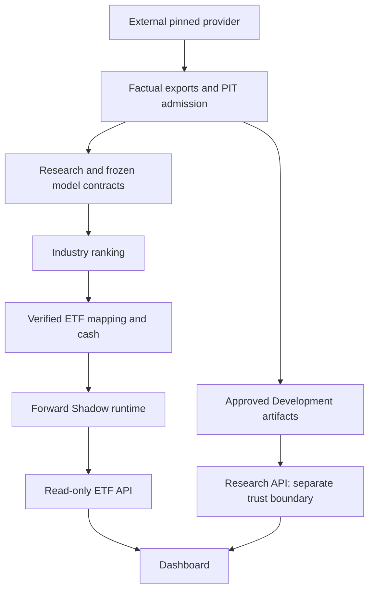

# quant-trading

[English](README.md) | [简体中文](README.zh-CN.md)

## Overview

quant-trading is a quantitative research and simulation software project for Chinese equities and ETFs. It ranks industries first, maps eligible industries to evidenced ETF exposures, and observes future paper accounting through a forward Shadow runtime. Its priorities are reproducibility, point-in-time (PIT) boundaries and research integrity.

It provides research tools and engineering contracts, not live trading, broker execution, investment advice or a profitability guarantee. Execution remains `SIMULATION_ONLY`, with `broker_enabled = false` and `real_order_path = false`.

## Why this project exists

Historical industry predictions, reconstructed membership and tradable ETF results are different evidence. The project separates those layers and makes source availability, label maturity, mapping evidence, realistic timing and immutable publication explicit. Engineering readiness and scientific conclusions can therefore be assessed independently.

## Current status

V1 has completed engineering preparation. Its first formal Shadow epoch has not been created; no first-epoch performance is claimed. V1 Validation and Final OOS remain sealed.

V2 is a `PROVISIONAL_HISTORICAL_RESEARCH_CANDIDATE`. Original Validation failed; the Validation-informed revision consumed its single original Final OOS. A directional Final-OOS result is **not independent statistical proof**. Current independent statistical confidence is **LIMITED**, historical membership confidence **RECONSTRUCTED**, and historical ETF execution validation **NOT_ESTABLISHED**. Historical gate classifications remain separate from this scientific overlay. There is no new unseen extension or resealing.

Both versions have forward Shadow engineering. Actual readiness depends on an operator's external evidence, frozen release and current calendar gates. See [research status](docs/research-status.md) and the [scientific assessment](config/research/etf-quant-v2-scientific-status.json).

## V1 and V2

These values come from the [V1 specification](services/etf-quant-api/strategy.json) and [frozen V2 candidate](strategies/etf_quant_v2/config/candidate.json).

| Contract | V1 | V2 |
| --- | --- | --- |
| Purpose | Frozen industry-first forward baseline | Evidence-tier research candidate and independent paper account |
| Model | Ridge, raw features | NumPy Ridge, raw features; S2A-RAW-m12-a30 |
| Alpha | 0.01 | 30.0 |
| Training window | 6 months; per-horizon mature-label cutoff | 12 months; mature labels and complete required history |
| Horizons | 10 / 40 / 120 sessions | 10 / 40 / 120 sessions |
| Fusion | 0.25 / 0.50 / 0.25; population z-scores | 0.25 / 0.50 / 0.25; population z-scores |
| Features | H10: d10, p5, align, vc, dd20; H40/H120: frozen 19-factor registry | Same five-factor H10 and frozen 19-factor H40/H120 sets |
| Research status | Engineering prepared; Validation/Final OOS sealed | Provisional historical candidate; consumed Final OOS; limited confidence |
| Mapping | Industry first, verified proxy, cash fallback | Same policy, independent frozen registry |
| Forward status | First formal epoch not created | Future post-freeze sessions only; no historical backfill |

Frozen specifications govern rolling fits; coefficients are refit using eligible observations after labels mature. See the [strategy contract](docs/strategy.md) for formulas and sizing.

## Research integrity

Development supports research choices. Validation and Final OOS have separate admission and consumption rules. Consumed OOS remains historical evidence and cannot become unseen through a new filename or longer interval. This engineering workflow authorizes no post-hoc retuning. Forward evidence comes only from genuinely future eligible sessions.

PIT availability is distinct from observation time. Reconstructed membership carries different confidence from contemporaneous records. Overlapping horizons introduce dependence; directional diagnostics cannot substitute for dependence-aware statistical confidence or historical ETF execution. The scientific overlay preserves these limits without rewriting frozen artifacts. See [data/PIT](docs/data-and-pit.md) and [reproducibility](docs/reproducibility.md).

## Strategy overview

Three independent multi-horizon Ridge fits produce cross-sectional industry scores. Population z-scores are fused; the original Top5 industries receive capped softmax weights. Mapping follows ranking. An unexecutable slot keeps its original weight as cash rather than being replaced by a lower-ranked industry. Collision handling and the 35% target-weight cap remain frozen contracts.

## ETF mapping

Direct industry tracking takes precedence. Verified proxies require complete official exposure evidence, at least 40% target-industry exposure, dominance, PIT availability and a complete 20-session liquidity window. Missing evidence never authorizes a proxy or substituted liquidity amount. Collisions are explicit; unmapped or non-executable slots become CASH.

The current independent V2 registry covers **22 of 124 industries**, as recorded in [research status](docs/research-status.md). Registry coverage does not mean every ETF is executable on every date. Actual eligibility still passes date-specific admission. See the [registry](strategies/etf_quant_v2/config/mapping-registry.json).

## Execution semantics

```text
T finalized close → signal → future legal T+1 actual raw open → simulated accounting
```

Delayed accounting retains actual evidence and chronology. No retroactive signal or fill is created. A missed T+1 becomes `ABANDONED_MISSED_T1`; its record remains and future legal epochs may continue. Idempotence and crash recovery prevent duplicate publication.

## Architecture



Research API serves approved Development artifacts; ETF API serves verified runtime observations. Neither observation API starts model search or a formal cycle. See [architecture](docs/architecture.md).

## Repository layout

| Path | Purpose |
| --- | --- |
| strategies/ | Self-contained V1, V2 and earlier strategy packages |
| research/ | Research lineage and evidence-tier reconstruction |
| src/ | Data/provider and notification infrastructure |
| services/ | Source transport, canonical runner and read-only APIs |
| dashboard/ | Research and Shadow observation UI |
| scripts/ | Deployment, operations, evidence admission and engineering checks |
| config/ | Public contracts, templates and dependency metadata |
| docs/ | User, developer, deployment and operations guides |
| tests/ | Synthetic tests and marked maintainer integrations |
| reports/ | Public-safe provenance and engineering certificates; no market datasets |
| examples/ | Data-free contributor demo |

## Data-free quick start

Docker is the portable Python entry point. Its developer image is independent of the deployed research image. From a fresh clone, these commands need no private data or credentials:

```sh
git clone https://github.com/WynterYaxley123/quant-trading.git
cd quant-trading
docker build -f .devcontainer/Dockerfile -t quant-trading-dev:local .
docker run --rm -v "${PWD}:/workspace" quant-trading-dev:local python -m examples.minimal_demo
docker run --rm -v "${PWD}:/workspace" quant-trading-dev:local python -m pytest -q -m "not external_runtime"
```

Use a POSIX shell or PowerShell with Docker Desktop; `${PWD}` names the checkout. The deterministic synthetic demo creates no formal Shadow state. Frontend/API setup is in [development](docs/development.md). Full factual/provider setup is a separate [deployment workflow](docs/deployment.md).

## Development

The pinned toolchain uses Python 3.12.11, Node 24.19.0 and pnpm 11.25.0. Numerical Python work runs in Docker. Quality gates include Ruff lint/format, staged Mypy enforcement, pre-commit, references, integrity and source/history security auditing, plus API, runner, scheduler and frontend tests/types/lint/build. See [development](docs/development.md).

## Testing

Portable tests use synthetic inputs. `external_runtime` and private-data integrations require explicit maintainer evidence; framework/provider integration has separate environment requirements. SKIPPED, deselected and NOT_TESTED are not PASS. See [testing](docs/testing.md).

## Deployment model

The GitHub repository is the `SOURCE_OF_TRUTH_REPOSITORY`: it stores how to rebuild, verify and operate the software. A `LOCAL_DEPLOYMENT_ROOT` holds mutable facts, accounts, control metadata, logs, private configuration and external dependencies.

The maintainer reference layout uses a root such as `D:\QuantForge`. This is an implementation detail, not a required public path. Users may choose any suitable external root. See [deployment](docs/deployment.md) and [operations](docs/operations.md) ([中文](docs/operations.zh-CN.md)).

## Data and reproducibility

Market data is not distributed. Data redistribution rights are separate from source licensing. Complete deployment requires authorized external factual data and provider setup; see the [data-rights policy](docs/data/market_data_policy.md).

The public engineering workflow is reproducible. Fresh clone does not replicate the maintainer's factual lake, private evidence, historical ledger or live Shadow state. Synthetic fixtures cannot initialize a real account. See [reproducibility](docs/reproducibility.md).

## Security and contributing

Secrets stay outside Git. Bounded reads, resolved path containment, state isolation and hash checks define service boundaries. Operations tools fail closed and provide read-only diagnostics. See [security](SECURITY.md).

Fork/branch → PR → CI → review is the recommended contribution workflow, not a claim that GitHub branch protection is enforced. Preserve frozen contracts and keep private/market/runtime data outside Git. See [CONTRIBUTING.md](CONTRIBUTING.md).

## Documentation

[Architecture](docs/architecture.md) · [Research status](docs/research-status.md) · [Data/PIT](docs/data-and-pit.md) · [Deployment](docs/deployment.md) · [Operations](docs/operations.md) · [Reproducibility](docs/reproducibility.md) · [Testing](docs/testing.md) · [Security](SECURITY.md) · [Index](docs/index.md)

## License and disclaimer

Repository-owned source and documentation use [MIT](LICENSE); [third-party notices](THIRD_PARTY_NOTICES.md) apply to external software. Market-data rights remain separate. Research and simulation only; not investment advice and no profitability guarantee.
