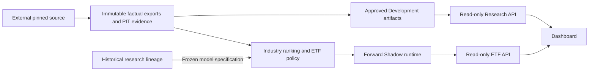

# quant-trading

`quant-trading` is a quantitative research/software project with a frozen baseline:
**ETF-Quant V1**, a Chinese equity ETF research and forward Shadow workflow that
ranks industries first, then maps them to executable ETFs. It turns dated factual inputs into industry rankings, evidence-backed ETF
mappings and an observable simulated portfolio. The dashboard reads verified artifacts.

Engineering preparation is complete. **The first formal Shadow epoch has not yet been
created.** There are no Shadow performance results. Historical Shenwan/F1 research is
the product's research lineage. The project is simulation/Shadow only, without brokers,
real orders, leverage or shorting. V1 sealed research phases remain inaccessible.

**ETF-Quant V2** reconstructs 2018–2026 factual history with explicit membership
evidence tiers. Actual Development experiments and one reserved Validation have
completed. Validation failed; one authorized Development revision selected Ridge
α=30, a 12-month window and 10/40/120-session predictions. This revision is
**Validation-informed and has not been independently validated**. Its independent
Shadow implementation is prepared but has not started. Final OOS remains sealed.
The [V2 protocol](docs/etf-quant-v2-protocol.md) and
[measured research status](docs/etf-quant-v2-development.md) explain the evidence
limits and results. No profitability claim is made.

## Strategy at a glance

Three independent Ridge models rank Shenwan Level-2 industries at 10, 40 and 120
session horizons. Population z-scores combine them at 0.25 / 0.50 / 0.25. The original
five highest-ranked industries receive capped softmax target weights. Direct tracking ETF mappings take precedence;
industry-exposure proxies require complete official weights, at least 40% target exposure, dominance,
PIT availability and liquidity. An unexecutable slot retains its original weight as cash.
Finalized T-close signals can only receive future T+1 simulated execution.

V1's factor sets and model specification are frozen; Ridge coefficients are refit
from eligible mature observations at each signal date. The original Top5 industry
ranking is mapped to executable ETFs, preserving unexecutable slots as cash. This order is
implemented in the [runtime](strategies/etf_quant/runtime/shadow.py) and covered by
[mapping regressions](tests/etf_quant/test_proxy_partial_contract.py).
See the [frozen strategy contract](docs/strategy.md). No profitability claim is made.
The historical policy identifier `B40_WITH_CASH` remains compatible; see the
[canonical glossary](docs/glossary.md).

## Data-free quick start

Docker is the portable Python development entry point. The developer image is
independent of the deployed research image. From your clone:

```sh
docker build -f .devcontainer/Dockerfile -t quant-trading-dev:local .
docker run --rm -v "${PWD}:/workspace" quant-trading-dev:local python -m examples.minimal_demo
docker run --rm -v "${PWD}:/workspace" quant-trading-dev:local python -m pytest -q -m "not external_runtime"
```

The demo prints a deterministic synthetic engineering result. It needs no market
data, credentials, CNEquity checkout or runtime namespace. See
[development](docs/development.md) for frontend setup and quality commands.

## Architecture

Three logical layers contain six principal components: factual exports; the
ranking/mapping pipeline and Shadow runtime; the Research API, ETF API and dashboard.



Research API exposes approved Development artifacts; ETF API exposes verified runtime
observations. Their distinct trust boundaries are explained in [architecture](docs/architecture.md).

## Repository layout

| Path | Purpose |
| --- | --- |
| strategies/etf_quant/ | Frozen V1 contracts and runtime |
| strategies/etf_quant_v2/ | Independent V2 candidate, gated forward preparation and paper accounting |
| strategies/sw_sector_rotation/, research/ | Earlier research lineage |
| research/etf_quant_v2/ | Evidence-tier reconstruction, actual diagnostics and bounded experiments |
| src/ | Data/provider and notification infrastructure |
| services/ | External source transport, runner and two read-only APIs |
| dashboard/ | Shared observation UI |
| scripts/ | Evidence admission and reproducible engineering tools |
| examples/minimal_demo/ | Data-free contributor example |
| tests/ | Synthetic and marked maintainer tests |
| reports/etf_quant/ | Immutable, data-free historical provenance metadata |
| docs/archive/ | Retained contract provenance and engineering certificates |

## Tests and quality

Public CI checks Ruff lint/format, **staged typing enforcement**, pre-commit, synthetic
Python tests/demo, frontend tests/types/lint/build, both APIs and repository-native
source/history security auditing. External-evidence maintainer tests are a separate
tier. [Testing](docs/testing.md) defines both.

## Shadow status and documentation

Readiness is an engineering statement, not an investment result. Formal cycles remain
forward-only. See [research status](docs/research-status.md), [operations](docs/operations.md),
[data and PIT](docs/data-and-pit.md), the [documentation index](docs/index.md) and
the [historical archive](docs/archive/README.md).

## License and market data

Source code uses [MIT](LICENSE); [third-party notices](THIRD_PARTY_NOTICES.md) apply.
Market-data redistribution rights remain separate and unverified. The repository
does not distribute market datasets. The [data-rights matrix](docs/data/market_data_policy.md)
records provider-specific evidence and required action.
