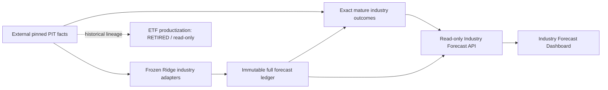

# quant-trading

[English](README.md) | [简体中文](README.zh-CN.md)

quant-trading studies **Shenwan Level-1 and Level-2 industry forecasts** with frozen multi-horizon
Ridge models, point-in-time facts and immutable forward observations. Its current
families are **SWL2-Ridge-V1** (frozen baseline) and **SWL2-Ridge-V2** (provisional
historical research candidate). Both have role `INDUSTRY_FORECAST_RESEARCH`.
SWL2 ETF productization is `RETIRED`. The independent **SWL1-Ridge-V1** generation
completed its 20-spec Development and failed its single Validation; Final OOS
was never opened. Its ETF productization is `NOT_STARTED` and forward eligibility is false.
The separately preregistered **SWL1-Ridge-V2** completed its frozen 16-spec search
and failed its only Validation. It is permanently closed, with no Final OOS
opened and forward eligibility false.

## Current research status

| Family | Level | Frozen universe | Model | Research status | Validation | Final OOS | Forward eligible | ETF productization |
| --- | --- | --- | --- | --- | --- | --- | --- | --- |
| SWL2-Ridge-V1 | 2 | 107 | Ridge | FROZEN_BASELINE | SEALED | SEALED | existing frozen forward path | RETIRED |
| SWL2-Ridge-V2 | 2 | 124 | Ridge | PROVISIONAL_HISTORICAL_RESEARCH_CANDIDATE | original FAIL | CONSUMED | existing frozen forward path | RETIRED |
| SWL1-Ridge-V1 | 1 | 30 (31 current identities) | Ridge alpha 100 / 12m / standardized 19 factors | FAILED_VALIDATION | FAIL | NOT_OPENED | false | NOT_STARTED |
| SWL1-Ridge-V2 | 1 | same 30 | penalty 10 × training rows / 24m / standardized 19 factors | FAILED_VALIDATION | FAIL | PROSPECTIVE_ONLY / NOT_OPENED | false | NOT_STARTED |

[V2's public preregistration](docs/research/swl1-ridge-v2-protocol.md) merged
before factual metrics. Three of 16 Development specs were admitted; candidate
B-m24-l10 had [single Validation](docs/research/swl1-ridge-v2-results.md)
composite RankIC −0.030123, H120 −0.161329, weighted positive fraction 41.87%
and 1/4 positive calendar blocks. No retry, revision or OOS follows. The same
reconstructed Level-1 equal-weight primary target was retained.

SWL1 is not SWL2 V3. [Its protocol](docs/research/swl1-ridge-v1-protocol.md) was
committed before performance, with exact 120-session purges and a 20-spec budget.
The [single Validation](docs/research/swl1-ridge-v1-results.md) had composite RankIC
−0.076308, weighted positive fraction 42.26%, weighted raw spread −1.5404% and
2/4 positive blocks. The failure is final for V1. The
[generic catalog](config/research/industry-forecast-families.json) exposes this
historical record without enabling a model, reading its runtime or creating forecasts.

The unchanged [SWL2 registry](config/research/swl2-ridge-families.json) binds names,
legacy identities, actual admitted universes and frozen model hashes. V1 emits all
**107** admitted industries; V2 emits all **124** from its byte-pinned warmup.
Expanding V1 would alter its training and target centering, so it retains 107.
There are no forward forecasts or matured observations created by this delivery.
Missing quantitative metrics are **null**, with honest empty dashboard states.

V1 Validation and Final OOS remain sealed. V2 is
`PROVISIONAL_HISTORICAL_RESEARCH_CANDIDATE`: the original Validation failed and
the Validation-informed revision consumed its one original Final OOS.
Historical directional Final OOS is `STRONG_POSITIVE`; independent statistical
confidence is `LIMITED`, membership is `RECONSTRUCTED`, and historical ETF
execution validation is `NOT_ESTABLISHED`. Consumed OOS cannot be resealed into
unseen evidence. Historical classifications and bytes remain intact.

## Frozen scientific contracts

| Contract | SWL2-Ridge-V1 | SWL2-Ridge-V2 |
| --- | --- | --- |
| Admitted universe | 107 | 124 |
| Ridge alpha / window | 0.01 / 6 months | 30.0 / 12 months |
| Features | Frozen 5 for H10; 19 for H40/H120 | Same frozen factor sets |
| Input mode | Raw X | S2A-RAW-m12-a30 |
| Horizons | H10 / H40 / H120 trading sessions | H10 / H40 / H120 trading sessions |
| Fusion | Population z-score, 0.25 / 0.50 / 0.25 | Population z-score, 0.25 / 0.50 / 0.25 |
| Role | Frozen baseline industry research | Provisional historical industry candidate |

Rolling coefficients use only mature eligible labels. This transition performs no
model search, retuning, new Validation or OOS evaluation. The scientific target
remains each exact H-session industry return minus that date's frozen-universe
mean. Research budget means an experiment/phase budget; money and account sizing
are absent from the active industry path.

## Forward observations and evaluation

The actual merge identity is resolved from main; a separate immutable runtime
binding freezes source, model and activation time. The first eligible forecast is
on an official session strictly after both merge and activation dates, using
current finalized facts observed after 15:05 Shanghai time. Missing sessions
cannot be backfilled. Preflight and dry-run never write or freeze anything.

Each immutable publication stores the entire admitted cross-section: industry
name/code, raw H10/H40/H120 prediction, z-score, horizon rank, fused score/rank,
data cutoff, source commit, model hash and provenance. Duplicate retries skip
refitting; atomic generations, OS mutexes and verified journals recover crashes.

Horizon evaluation stays `PENDING` until the exact exchange-session maturity and
all required points finalize. No provisional close, gap bridge or future value
is used. Descriptive diagnostics include Spearman RankIC, horizon Top5/Bottom5
returns and spread, actual Top5 overlap, rank errors, rolling 20-date means and
the worst 20-date spread interval. Empty metrics are null. Overlapping horizons
receive no statistical winner or significance claim.

`COMMON_FORWARD_WINDOW` matches real common dates and matured horizons. Because
universes differ, its additional `COMMON_INDUSTRY_CROSS_SECTION_DIAGNOSTIC`
recomputes diagnostics on the industry intersection with equal realized returns;
each family's primary frozen-universe metrics remain separate.

## Realized series and visual diagnostics

Current admitted Source-C facts reconstruct exact-adjusted constituent industry
returns using existing dated membership/coverage rules. The explicit type is
`RECONSTRUCTED_SWL2_EQUAL_WEIGHT`. Official taxonomy provenance does not make these
official index bars. No authorized official SWL2 index-bar source is established
in the admitted adapters. Local evidence does not grant redistribution rights.

The dashboard defaults to Industry Forecast: complete rankings, Top5, signal
history, maturity, predicted/realized comparisons and common-window diagnostics.
Matured paths start at 1.0 and are `VISUAL_TREND_DIAGNOSTIC`,
`NORMALIZED_RESEARCH_INDEX`, `NON_TRADABLE_RESEARCH_DIAGNOSTIC`. They are independent
signal outcomes, with a SWL2 universe equal-weight baseline, never a chained
tradable NAV. Scores and realized trend paths have separate views.

## Historical ETF productization

ETF availability, exposure purity and execution evidence proved insufficient for
reliable Level-2 product coverage. That is a `HISTORICAL_PRODUCTIZATION_RESULT`.
Current industry forecasts require no ETF mappings, portfolio targets, cash slots,
initial capital, position caps, lots, costs, fills or account events.

Historical `ETF_QUANT_V1` / `ETF_QUANT_V2` configs, mappings, releases, Shadow
artifacts, reports, certificates and ledgers retain their identities and hashes.
Legacy APIs/pages remain read-only audit views with retirement metadata. Writer
commands fail closed; legacy writer regression requires an isolated synthetic
temporary namespace. No real orders, brokers, leverage or shorting are enabled.

## Architecture and layout



| Path | Purpose |
| --- | --- |
| strategies/swl2_ridge/ | Registry, adapters, ledger, maturity and descriptive metrics |
| services/industry-forecast-runner/ | Docker-only forward runner and disabled scheduler template |
| services/industry-forecast-api/ | Bounded read-only API |
| dashboard/ | Default industry research UI; historical audit routes |
| config/research/ | Canonical family and transition contracts |
| docs/industry-forecast.md | Scientific, factual and operational contracts |
| tests/ | Portable synthetic regression and marked external integrations |
| reports/ | Public-safe immutable evidence and chained source certificates |
| docs/archive/ | Byte-preserved historical documents |

## Data-free quick start

Use the independent developer image, never the deployed image or host quant Python.

```sh
git clone https://github.com/WynterYaxley123/quant-trading.git
cd quant-trading
docker build -f .devcontainer/Dockerfile -t quant-trading-dev:local .
docker run --rm -v "${PWD}:/workspace" quant-trading-dev:local python -m examples.industry_forecast_demo
docker run --rm -v "${PWD}:/workspace" quant-trading-dev:local python -m pytest -q -m "not external_runtime"
```

Inside the developer container, use `pnpm --dir dashboard install --frozen-lockfile`,
then test/typecheck/lint/build. `node services/industry-forecast-api/server.mjs`
serves an honest empty state without runtime configuration. The runner requires
clean merged source and explicit external read-only facts; engineering does not
invoke it against live facts. The scheduler template is disabled; this delivery
promotes no live deployment and creates no business events.

## Documentation and contribution

Start with [industry forecast](docs/industry-forecast.md), [documentation index](docs/index.md),
[development](docs/development.md), [testing](docs/testing.md),
[data/PIT](docs/data-and-pit.md), [deployment](docs/deployment.md),
[operations](docs/operations.md), [reproducibility](docs/reproducibility.md),
[research status](docs/research-status.md) and [contributing](CONTRIBUTING.md).
The [historical strategy contract](docs/strategy.md) remains auditable.

SWL1-Ridge-V1 is closed after its failed Validation; it never repurposed SWL2
consumed evidence. A result-free [SWL1-Ridge-V2 draft](docs/research/swl1-ridge-v2-draft.md)
is not preregistered and has not been run. Source is [MIT licensed](LICENSE);
[third-party notices](THIRD_PARTY_NOTICES.md) and [data-rights policy](docs/data/market_data_policy.md)
apply independently. See [security reporting](SECURITY.md).

## Universe metadata and native targets

Current SWCLASS2021 taxonomy: **134** identities; legacy parsing inventory: **63**.
Frozen models retain **107 / 124**, with **27 / 10** taxonomy-only exclusions.
The API derives these values from pinned references and reports actual publication
row counts separately. Historical ETF coverage is a productization result.

| Family | Industry universe | Frozen model size | Model | Current role | Historical status | ETF productization |
| --- | --- | --- | --- | --- | --- | --- |
| SWL2-Ridge-V1 | Shenwan Level-2 | 107 | Frozen Ridge baseline | INDUSTRY_FORECAST_RESEARCH | Validation/OOS SEALED | RETIRED |
| SWL2-Ridge-V2 | Shenwan Level-2 | 124 (verified warmup projection) | Frozen Ridge challenger | INDUSTRY_FORECAST_RESEARCH | PROVISIONAL_HISTORICAL_RESEARCH_CANDIDATE | RETIRED |

For each (signal date, horizon), the scientific target is exact h-session compounded
industry return minus the mean over that family's complete frozen universe.
Common diagnostics verify shared **raw returns**, not equality of differently
centered targets. Historical ETF productization was retired for the SWL2 family
because reliable executable ETF coverage was structurally insufficient relative
to the Level-2 research universe. Historical engineering remains reproducible.
