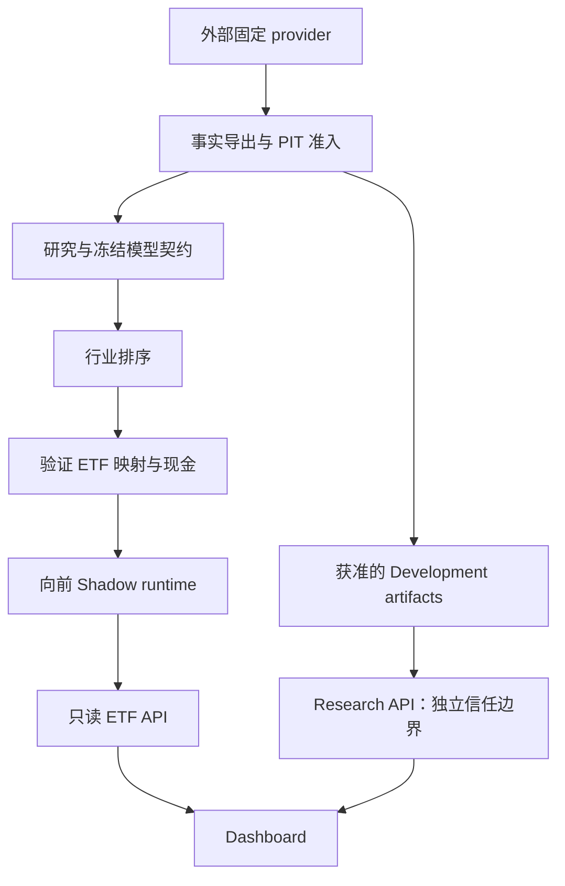

# quant-trading

[English](README.md) | [简体中文](README.zh-CN.md)

## 项目简介

quant-trading 是面向中国股票与 ETF 工作流的量化研究和模拟软件项目。
它先对行业排序，再将符合证据要求的行业映射到 ETF，通过向前推进的 Shadow
运行系统观察模拟记账。重点是可复现性、时点信息（PIT）边界和研究完整性。

项目提供研究工具和工程契约，不提供实盘机器人、券商执行、投资建议或收益保证。
模式始终为 `SIMULATION_ONLY`，`broker_enabled = false`、`real_order_path = false`。

## 项目目标

历史行业预测、重建的行业成员关系和可交易 ETF 的表现是不同层次的证据。
项目将它们分开，明确数据可用时间、标签成熟、映射证据、真实执行时序与不可变发布，
使工程准备完成与科学结论成立可以分别判断。

## 当前状态

V1 已完成工程准备，尚未创建首个正式 Shadow epoch，不声称已有首期实际表现。
V1 Validation 和 Final OOS 仍保持封存。

V2 当前为 `PROVISIONAL_HISTORICAL_RESEARCH_CANDIDATE`。原始 Validation 未通过；
根据 Validation 信息修订的候选已消耗唯一一次原始 Final OOS。
**Final-OOS 的方向性结果不等于独立统计证明。** 当前独立统计置信度为 **LIMITED**，
历史成员置信度为 **RECONSTRUCTED**，历史 ETF 执行验证为 **NOT_ESTABLISHED**。
历史 gate 分类与当前科学评估分别保留，不通过改名、扩展或重新 seal 声称获得新的 unseen OOS。

两版本已有向前 Shadow 工程机制。实际能否运行取决于部署者的外部事实证据、冻结 release 与当前日历 gate。
详见[研究状态](docs/research-status.md)和[科学评估](config/research/etf-quant-v2-scientific-status.json)。

## V1 与 V2

下表取自当前 [V1 规格](services/etf-quant-api/strategy.json)和
[V2 冻结候选](strategies/etf_quant_v2/config/candidate.json)。

| 契约 | V1 | V2 |
| --- | --- | --- |
| 用途 | 冻结的行业优先向前基线 | 证据分层研究候选与独立模拟账户 |
| 模型 | Ridge，原始特征 | NumPy Ridge，原始特征；S2A-RAW-m12-a30 |
| Alpha | 0.01 | 30.0 |
| 训练窗口 | 6 个月，各 horizon 按成熟标签截断 | 12 个月，要求标签成熟且历史完整 |
| Horizons | 10 / 40 / 120 个交易日 | 10 / 40 / 120 个交易日 |
| 融合 | 0.25 / 0.50 / 0.25，总体标准化 | 0.25 / 0.50 / 0.25，总体标准化 |
| 特征集 | H10：d10、p5、align、vc、dd20；H40/H120：冻结的 19 因子集 | 相同五因子 H10 和冻结 19 因子 H40/H120 集 |
| 研究状态 | 工程准备完成；Validation/Final OOS 封存 | 暂定历史候选；Final OOS 已消耗；独立置信度有限 |
| 映射 | 行业优先、验证代理、现金回退 | 相同政策，独立冻结 registry |
| 向前状态 | 首个正式 epoch 尚未创建 | 仅冻结后未来合法交易日，不回填历史 |

冻结的是规格，回归系数仍会使用成熟的合格观测滚动拟合。
因子公式、权重和执行细节见[策略契约](docs/strategy.md)。

## 研究完整性

Development 用于研究选择，Validation 与 Final OOS 有独立准入和消耗规则。
Consumed OOS 永远是历史证据，不会因换文件名或延长区间而成为未知样本。
工程工作流不授权事后调参；向前证据只能来自真实未来的合法时点。

PIT 可用时间与观测时间不能混同。重建成员关系与当时留存事实属于不同置信层级。
重叠 horizon 带来依赖性，方向性诊断不能替代考虑依赖性的统计置信度或 ETF 历史执行验证。
当前科学状态保留这些限制，不改写冻结记录。详见[数据/PIT](docs/data-and-pit.md)、
[可复现性](docs/reproducibility.md)。

## 策略概览

三个独立的多 horizon Ridge 模型生成横截面行业分数，总体标准化后融合。
原始 Top5 行业以带上限的 softmax 获得权重。先排序再映射，无法执行的槽位保留原权重为现金，
不以低排名行业替换。碰撞处理和 35% 目标权重上限继续遵循冻结契约。

## ETF 映射

行业直接跟踪映射优先。验证代理需要完整官方暴露证据、至少 40% 的目标行业暴露、主导性、
PIT 可用性和完整的 20 交易日流动性窗口。缺失证据不能授权代理，也不能替换必需成交额。
碰撞显式处理，无法映射或执行的槽位进入 CASH。

当前独立 V2 registry 覆盖 **124 个行业中的 22 个**，与[研究状态](docs/research-status.md)一致。
这是 registry 覆盖率，不表示所有 ETF 每天都可执行；逐日准入仍须通过 gate。
详见[映射 registry](strategies/etf_quant_v2/config/mapping-registry.json)。

## 执行语义

```text
T 日最终收盘 → 信号 → 未来合法 T+1 的真实原始开盘 → 模拟记账
```

可以延后处理记账，但须保留真实证据和原始时序，不制造 retroactive signal 或 fill。
错过 T+1 后为 `ABANDONED_MISSED_T1`，保留记录，后续合法 epoch 可以继续。
幂等和崩溃恢复机制防止重复发布。

## 架构



Research API 展示获准的 Development artifacts，ETF API 展示验证后的运行观测。
两个观测 API 都不启动模型搜索或正式周期。详见[架构](docs/architecture.md)。

## 仓库结构

| 路径 | 用途 |
| --- | --- |
| strategies/ | 自包含的 V1、V2 和早期策略包 |
| research/ | 研究来源与证据分层重建 |
| src/ | 数据/provider 和通知基础设施 |
| services/ | Source transport、canonical runner、只读 API |
| dashboard/ | 研究与 Shadow 观测界面 |
| scripts/ | 部署、运维、证据准入与工程检查 |
| config/ | 公共契约、模板和依赖元数据 |
| docs/ | 用户、开发、部署和运维指南 |
| tests/ | 合成测试与标记的维护者集成测试 |
| reports/ | 可公开的来源元数据与工程证书，不含市场数据集 |
| examples/ | 无数据贡献者演示 |

## 无数据快速开始

Python 数值执行使用 Docker，开发镜像独立于正式研究镜像。
下列命令可在 fresh clone 中执行，不需要私有数据或凭证：

```sh
git clone https://github.com/WynterYaxley123/quant-trading.git
cd quant-trading
docker build -f .devcontainer/Dockerfile -t quant-trading-dev:local .
docker run --rm -v "${PWD}:/workspace" quant-trading-dev:local python -m examples.minimal_demo
docker run --rm -v "${PWD}:/workspace" quant-trading-dev:local python -m pytest -q -m "not external_runtime"
```

使用 POSIX shell 或配合 Docker Desktop 的 PowerShell，`${PWD}` 表示 checkout。
确定性合成演示不创建正式 Shadow 状态。前端/API 开发见[开发指南](docs/development.md)，
完整事实/provider 环境另见[部署指南](docs/deployment.md)。

## 开发

固定工具链为 Python 3.12.11、Node 24.19.0、pnpm 11.25.0。Python 数值工作在 Docker 中执行。
工程 gate 包括 Ruff lint/format、分阶段 Mypy、pre-commit、文档引用、完整性、源码/历史安全审计，
以及 API、runner、scheduler、前端的测试、类型检查、lint 和构建。详见[开发指南](docs/development.md)。

## 测试

Portable tests 使用合成输入。`external_runtime` 和私有数据集成需要显式维护者证据；
framework/provider 集成有独立环境要求。SKIPPED、deselected、NOT_TESTED 不等于 PASS。
详见[测试说明](docs/testing.md)。

## 部署模型

GitHub 仓库是 `SOURCE_OF_TRUTH_REPOSITORY`，保存如何重建、验证和运行软件。
`LOCAL_DEPLOYMENT_ROOT` 保存本机可变事实、账户、控制元数据、日志、私有配置和外部依赖。

维护者参考布局使用类似 `D:\QuantForge` 的根目录，这只是实现细节。
公共用户可选择任意合适的外部路径。详见[部署指南](docs/deployment.md)、
[英文运维手册](docs/operations.md)、[中文运维手册](docs/operations.zh-CN.md)。

## 数据与可复现性

仓库不分发市场数据。再分发权与源码许可证分别判断，完整部署需要有权使用的外部事实数据和 provider 配置。
详见[数据权利政策](docs/data/market_data_policy.md)。

公共工程工作流可以复现，但 fresh clone 不会复制维护者的事实湖、私有证据、历史账本或 live Shadow 状态。
合成测试 fixture 不能初始化真实账户。详见[可复现性](docs/reproducibility.md)。

## 安全与贡献

Secret 留在 Git 之外。有界读取、解析后路径包含关系、状态隔离和哈希验证构成服务边界。
运维工具 fail closed，并提供只读诊断。详见[安全说明](SECURITY.md)。

推荐 fork/branch → PR → CI → review；这不是对 GitHub branch protection 已强制启用的声明。
贡献应保留冻结契约，不将私有、市场或 runtime 数据写进 Git。详见[贡献指南](CONTRIBUTING.md)。

## 文档导航

[架构](docs/architecture.md) · [研究状态](docs/research-status.md) · [数据/PIT](docs/data-and-pit.md) ·
[部署](docs/deployment.md) · [运维](docs/operations.zh-CN.md) · [可复现性](docs/reproducibility.md) ·
[测试](docs/testing.md) · [安全](SECURITY.md) · [完整索引](docs/index.md)

## 许可证与声明

仓库自身源码和文档采用 [MIT](LICENSE)，外部软件遵循[第三方说明](THIRD_PARTY_NOTICES.md)。
市场数据权利独立判断。仅用于研究和模拟，不构成投资建议，不保证盈利。
