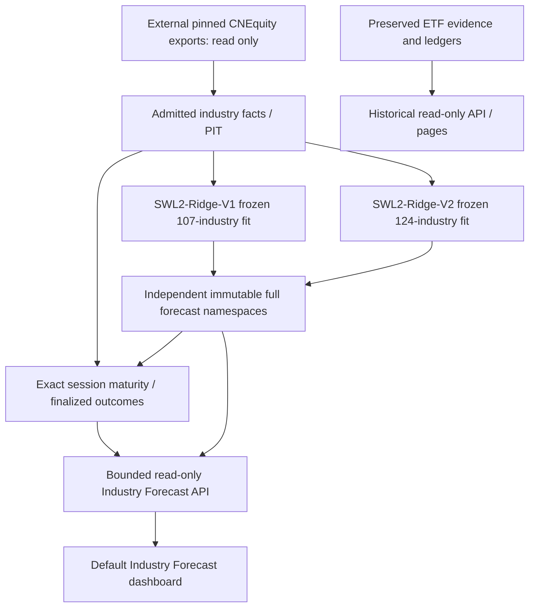

# Architecture

Current families share a naming registry, factual provenance, immutable forecast
storage and descriptive evaluation. Their frozen numerical implementations stay
self-contained; adapters remove the ETF execution boundary without changing fits.

No ETF facts, mappings, execution availability, target allocations, costs, capital,
account balance or NAV belong to active model prediction or evaluation. Legacy
transport/publication primitives supply hashes, OS locking, atomic generations and
crash recovery. They do not turn forecasts into portfolio accounting.

`strategies/swl2_ridge/registry.py` owns canonical identity. Adapters invoke frozen
prediction; facts validate PIT and reconstruction; ledger separates original
FORECAST from appended EVALUATION; engine enforces dates and maturity; metrics
report scientific and shared-universe diagnostics. The runner requires clean merged
source and external roots. The API verifies parent-bound source integrity and
bounded runtime generations; the frontend performs no fitting or data import.

Historical Research API remains separate at `/research`; legacy ETF routes retain
audit access with retirement metadata. Default `/` never accesses old account APIs.
See [industry contracts](industry-forecast.md), [deployment](deployment.md) and
[source transition evidence](engineering/swl2-industry-forecast-transition.md).

## Closure contracts

Registry -> pinned universe resolution -> frozen adapter -> immutable full publication -> exact session maturity -> native centered evaluation -> bounded read-only API -> Dashboard. Taxonomy inventory, model universe and actual forecast rows are separate fields. Common intersection metrics are additional diagnostics. Historical ETF productization stays read-only and outside this active flow.

## Independent industry levels

The generic catalog is config/research/industry-forecast-families.json; Python discovery is strategies/industry_forecast/registry.py. It references the byte-identical SWL2 catalog and an independent SWL1 closed family. Universes and targets never merge. The read-only industry API exposes failed research families while bypassing their runtime entirely. SWL1 V1 is FAILED_VALIDATION, forward-ineligible; numerical SWL2 adapters remain unchanged.
