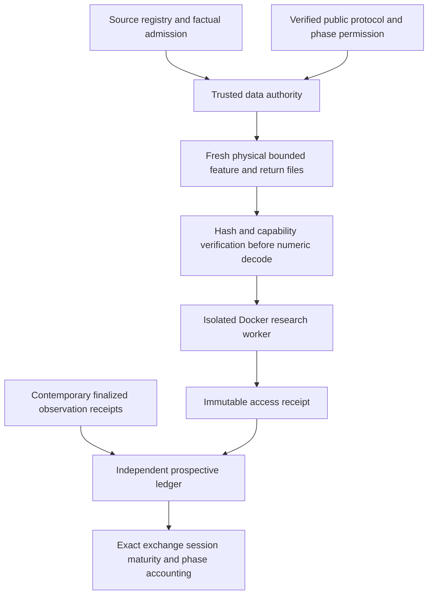

# Prospective evidence architecture

This is TESTED_INFRASTRUCTURE_NOT_LIVE_ACTIVATION. All executable authority,
protocol and ledger examples are SYNTHETIC_ONLY. No formal new family is registered.
Production signing/admission and actual forward facts remain absent.

The authority is trusted staging and may read the mother dataset after verifying
source, rights, contract and phase. That access is explicitly outside worker
isolation. The worker receives fresh bounded NPY files and a pinned manifest;
features and realized returns have separate cutoffs. It has no original dataset,
authority secret, ledger write capability, network or live mounts.

The [ledger](../../research/evidence/ledger.py) reuses existing storage mutex,
atomic bytes, immutable generation, publication journal and crash recovery primitives.
Its external prospective/synthetic-* namespace cannot be the old ETF/SWL2 ledger
or a Git checkout. Events are bounded, hash-linked, authenticated and replayed;
no mutable status file determines independence. Duplicate identical IDs are NOOP;
conflicts, backdated timestamps, deleted pointers with retained history, protocol
replacement and lifecycle reopening fail closed. Administrative destruction of an
entire authority/store cannot be prevented by local hashes alone; production needs
reviewed identity, durable external receipts and operator controls.

States: NOT_PREREGISTERED → PREREGISTERED → ACTIVATED →
COLLECTING_PROSPECTIVE_FACTS → WAITING_FOR_MATURITY →
READY_FOR_AUTHORIZED_PHASE → PHASE_CONSUMED → CLOSED; revision enters BLOCKED.
Maturity verifies authenticated full-universe finalized receipts on every required
session, with no pending revision. A different phase must have disjoint outcome
intervals; a consumed phase never becomes unseen. No prediction/model code exists
in this layer.

The [public anchor auditor](../../research/evidence/anchor.py) fetches bounded
public GitHub HTTPS metadata itself, checks main ancestry, exact first protocol
bytes, result-free history and protocol-only diff. Handwritten merged_at and author
timestamps are not inputs. Metadata verification alone is not production signing.
Synthetic activation accepts only an authenticated synthetic witness; production
activation is blocked until an independently reviewed authority is established.
First legal observation is a session strictly after the merge date in Shanghai.

Horizon values come from protocol. H10/H40/H120 fixtures validate exact t+h session
positions, complete constituent/full-universe receipts and finalization. Missing
facts remain PENDING_MATURITY. Calendar availability never finalizes price truth.
126 contiguous H120 signals share outcomes over 245 distinct outcome sessions;
counts are not independent experiments. Purge and interval overlap are computed
from the admitted session spine.

[Source contract](source-admission-contract.md) ·
[Numeric isolation](numeric-access-isolation.md) ·
[Operations](prospective-evidence-operations.md) ·
[Acceptance](swl1-data-first-acceptance.md)
