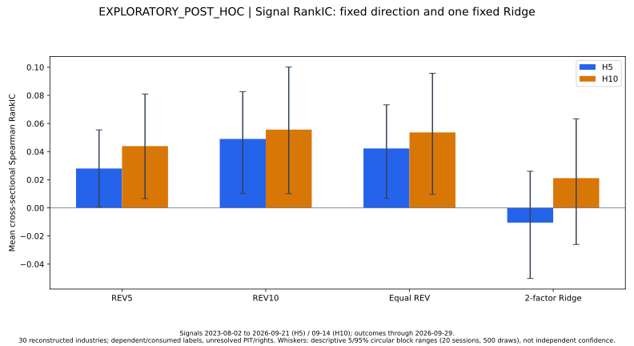
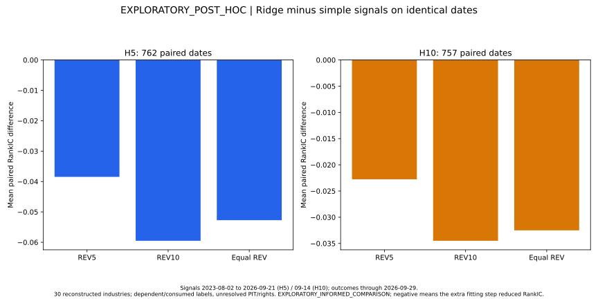
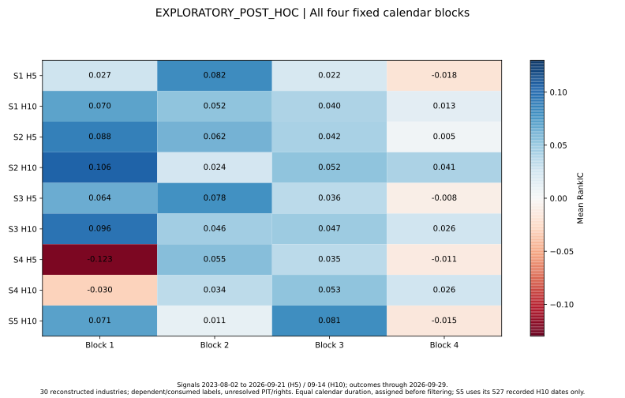
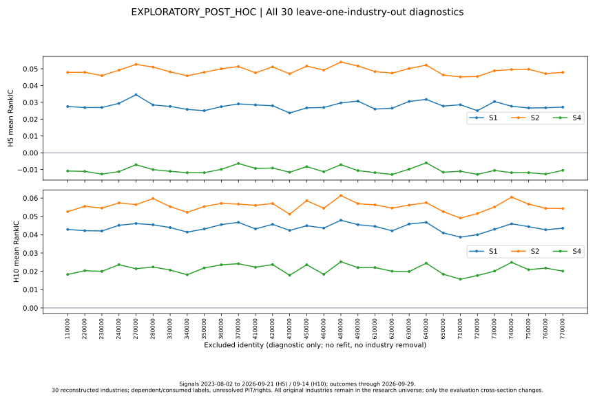
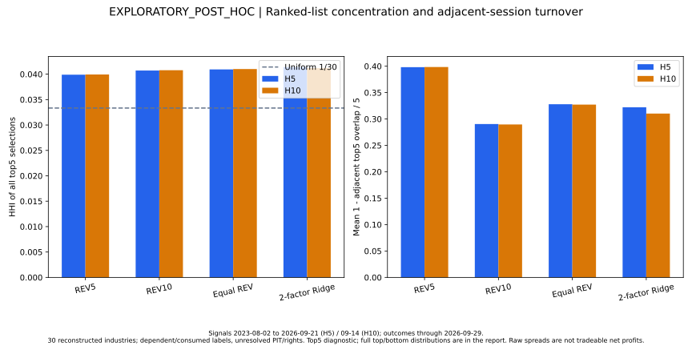
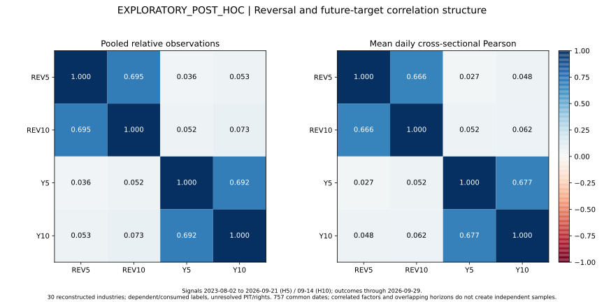

# SWL1 H5/H10 exploratory signal research

## Executive Summary

Actual historical numerical research was run on the existing, owner-authorized
consumed panel. The fixed-direction reversal signals have weak positive
descriptive associations; the fitted two-feature Ridge adds no aggregate RankIC
or raw-spread benefit. The locked recommendation is **A: consider future
independent preregistration**, conditional on data rights and historical/PIT
qualification. This is a research priority, not a Validation PASS, formal model
or trading recommendation. V1 and V2 remain **FAILED_VALIDATION**.

Read the [Chinese assessment](swl1-short-horizon-exploration.zh-CN.md),
[design review](swl1-short-horizon-design-review.md) and
[machine decision](../../reports/research/swl1_short_horizon_exploration/research-decision.json).

## Data and Target

The pinned CNEquity source is `1650e384a3fd1f67a70144a489acc91432f1df27`.
The existing panel is RECONSTRUCTED_SWL1_EQUAL_WEIGHT, not the official industry
index. Its SHA256 is `20c038f87daa93cccf1515f41bda7de5b30fa70a4d1443ae6c34b770e19a5776`.
All 30 frozen industries are retained. The existing exclusion of 综合 (510000)
is a recursive-series factual gap, not performance-based selection.

The study starts on 2023-08-02. H5 has 762 complete signals through 2026-09-21;
H10 has 757 through 2026-09-14. Both last targets mature on 2026-09-29. There are
no incomplete study cross-sections and no Ridge fit drops. H5 is explicitly a
RETROSPECTIVE_EXPLORATORY_LABEL. For each horizon independently, the raw target
is `product(1+r[t+1:t+h+1])-1`; the scientific relative target subtracts the
same-date mean of exactly the same 30 industries. Spearman and the signed spread
are unchanged by subtracting this common mean. No horizon is fused or selected.

Owner authorization permits this consumed historical exploration with unresolved
vendor rights. It is not a vendor grant or prospective production admission.
Current-taxonomy reconstruction, historical membership availability, survivorship,
adjustment conventions and official-index parity remain uncertified. Formal real
source admission remains zero. No new market source, refresh or download was used.

Before decoding numeric values, preparation wrote its boundary and checked the
owner instruction hash, frozen panel, implementation, universe and reference
hashes. The existing bounded NPY decoder converted only 1,252 return rows and
1,132 original feature rows; Fortran tail bytes were discarded without numeric
conversion. The later 2026-09-30 outcome was not decoded. The actual research
worker received a physically truncated, read-only view in network-disabled Docker,
with no original panel, upstream lake, OOS, credentials or lifecycle directory.
[Boundary and read receipts](../../reports/research/swl1_short_horizon_exploration/data-boundary.json)
retain the original historical-access uncertainty; this task cannot certify what
old executors or humans may have seen.

## Hypotheses

Recent relative losers may recover over H5/H10 after transient demand or liquidity
pressure. REV5 and REV10 use the frozen definition: **negative arithmetic mean of
the last 5/10 daily returns through T close**, not negative compounded trailing
returns. The first reconstructed price has no preceding close; its seed return
cannot enter a price-change factor. The adapter reproduces the frozen 6/11-row
warmup and available REV values within `1.1622647289044608e-16`.

Subtracting the same industry-mean return is rank-equivalent to the absolute
reversal signal. It cannot supply an extra ranking advantage. H5 and H10 may
respond differently. Two transparent features may improve interpretability,
but extra fitting is required to demonstrate an actual stable gain.

## Methodology

The [manifest](../../config/research/swl1-short-horizon-exploratory-design.json)
was committed as `ca959d99e01bc9093bde714dd67004f31940c09b` before new performance
diagnostics. Prior V1/V2 and forensic results were known; this engineering order
record is **not independent preregistration or an external scientific anchor**.

Six structures were fixed: S0 zero; S1 REV5; S2 REV10; S3 equal same-date
population-z REV5/REV10; S4 two relative reversal features with Ridge; S5 recorded
frozen V2 H10 predictions. S5 has no H5 counterpart and was not retrained.
There were no factor subsets, replacement signals, alpha grids, training-window
sweeps, weight optimization or seventh model. S4 uses 24 calendar months,
penalty 10 per training industry row, train-only pooled population scaling,
unpenalized intercept and the existing augmented least-squares Ridge solver.
Every training date is before T and every training label matures by T.
All 1,519 fits retain their exact private indices, ranges and maturity dates.

Metrics use average-tie Spearman. Both top/bottom ties use ascending industry
code; overlapping tied groups have undefined spread. S0 has undefined RankIC,
ranked groups and turnover, rather than an artificial zero-IC or code-selected
portfolio. Four equal-calendar blocks are assigned over the full fixed span
before exclusions. All 30 leave-one-out evaluations are diagnostic only; they
neither retrain the model nor remove an industry from the frozen universe.

## Results

All values below are post-hoc descriptions. Spreads are raw mean Top5 minus
Bottom5 forward returns **in percentage points**, not net profits.

| Structure | H5 mean IC | H5 median IC | H5 positive fraction | H5 spread (pp) | H10 mean IC | H10 median IC | H10 positive fraction | H10 spread (pp) |
|---|---:|---:|---:|---:|---:|---:|---:|---:|
| S0 zero | undefined | undefined | undefined | undefined | undefined | undefined | undefined | undefined |
| S1 REV5 | 0.027975 | 0.005117 | 50.52% | 0.090419 | 0.043912 | 0.040712 | 54.82% | 0.267861 |
| S2 REV10 | 0.048998 | 0.052725 | 56.56% | 0.198922 | 0.055633 | 0.063404 | 57.46% | 0.381961 |
| S3 equal REV | 0.042234 | 0.048943 | 54.72% | 0.126829 | 0.053640 | 0.070523 | 58.12% | 0.326525 |
| S4 two-factor Ridge | -0.010506 | -0.012458 | 48.56% | -0.220085 | 0.021140 | 0.038042 | 53.37% | 0.131328 |

S1–S4 use identical complete dates within each horizon. Ridge minus REV10 paired
mean IC is -0.059504 at H5 and -0.034492 at H10; paired raw spreads are also worse.
The equal combination does not improve on REV10's mean IC or spread. This is an
informed comparison, not selection of a validated winner.

S5's 527 recorded H10 dates give mean IC 0.038036. Its original native Development
(401 dates) and Validation (126) means reproduce 0.037213 and 0.040652, respectively,
with raw-spread parity within 1e-12. These are read-only checks against already
published aggregates, not another Validation execution. Exact-date simple-minus-S5
IC differences are +0.017696 (S1), +0.024744 (S2), +0.025620 (S3) and -0.023128 (S4).
No full-span-versus-native-period or new-H5-versus-old-H10 winner claim is made.
[Full comparison and provenance](../../reports/research/swl1_short_horizon_exploration/model-comparison.json).

## Stability

| Signal / horizon | Block 1 | Block 2 | Block 3 | Block 4 |
|---|---:|---:|---:|---:|
| REV5 H5 | 0.027338 | 0.081736 | 0.021793 | -0.018080 |
| REV5 H10 | 0.069978 | 0.052163 | 0.040191 | 0.013366 |
| REV10 H5 | 0.088385 | 0.061850 | 0.042173 | 0.004883 |
| REV10 H10 | 0.105521 | 0.024259 | 0.052143 | 0.041076 |
| Equal REV H5 | 0.064446 | 0.078419 | 0.035531 | -0.008245 |
| Equal REV H10 | 0.096324 | 0.045644 | 0.047008 | 0.025919 |
| Ridge H5 | -0.122823 | 0.055355 | 0.034554 | -0.011476 |
| Ridge H10 | -0.029650 | 0.033930 | 0.052597 | 0.026372 |

All blocks are shown. REV10 H5 weakens to almost zero in the last block; REV5 H5
changes sign. A global positive mean does not establish stable predictive ability.
Across all 30 leave-one-out diagnostics, REV5 mean IC ranges 0.023701–0.034584
(H5) / 0.038674–0.047900 (H10); REV10 ranges 0.045179–0.054026 /
0.049089–0.061388. Removing any single industry does not reverse the full-span
association. This does not rule out joint sector, common-factor or data biases.

Top5 selection HHI is about 0.040–0.041, above the uniform 1/30 benchmark but
not dominated by one identity. Adjacent Top5 turnover is about 0.398 for REV5,
0.290 for REV10, 0.328 for their combination and 0.310–0.321 for Ridge. These
are ranked-list diagnostics, not executed turnover or cost-adjusted returns.

## Failure Analysis

| Specification | Economic interpretation and observed limitation |
|---|---|
| S0 | No directional hypothesis; an honest undefined-ranking control. |
| S1 | Faster transient-pressure repair is plausible, but H5 median is near zero and the last block is negative. Noise and reconstruction bias remain alternatives. |
| S2 | Smoother reversal exposure is positive in all fixed blocks, with slower list turnover. Last-block H5 attenuation prevents a persistence or net-profit claim. |
| S3 | Combining two windows may reduce proxy noise, but their pooled correlation is 0.695 (daily cross-sectional mean 0.666). The combination adds no mean-IC/spread gain over S2; no replacement factor was searched. |
| S4 | Learns a historical conditional linear relationship rather than enforcing reversal direction. Negative early weights and strongly changing associations can hurt the intended direction. Regularized condition is about 1.136 and slope degrees of freedom about 0.174: numerical solvability and coefficient stability do not establish forecast information. |
| S5 | The consumed frozen multi-horizon model is a historical reference. Its H10 association does not repair its failed multi-horizon contract or negative H120 evidence. |

The four locked states are descriptive. REV10 H10 mean IC is 0.003274 (up/low
dispersion), 0.042213 (up/high), 0.062024 (down/low) and 0.152869 (down/high),
with 260/161/186/150 dates. The strongest down/high association is consistent
with transient pressure, but cannot identify a cause or justify a state filter.
The trailing covariance participation ratio averages roughly 1.91–2.47 across
these states, reflecting strong common movement despite 30 identities.

Short-horizon liquidity provision is one plausible interpretation discussed by
[Nagel, Evaporating Liquidity](https://www.nber.org/papers/w17653). This study
contains no direct liquidity or order-flow identification. Lead/lag relationships
can also generate contrarian associations without overreaction, as explained by
[Lo and MacKinlay](https://academic.oup.com/rfs/article-abstract/3/2/175/1595488).
Industry momentum at other horizons is documented by
[Moskowitz and Grinblatt](https://onlinelibrary.wiley.com/doi/abs/10.1111/0022-1082.00146);
that evidence does not transfer automatically to Chinese H5/H10 reconstruction.
**MECHANISM_NOT_IDENTIFIED** remains the causal conclusion.

Frozen V1 Validation H10 was -0.140064; V2 H10 was +0.040652 while V2 H120 was
-0.161329 and composite -0.030123. Different original periods, feature sets and
phase roles prevent direct model superiority claims. A short-lived repair effect
could differ from six-month industry leadership. This time-scale hypothesis is
compatible with the failures, but no H120 outcome was newly evaluated here.

## Statistical Limitations

REV5 RankIC lag-1 autocorrelation is 0.541 at H5 / 0.680 at H10; REV10 is
0.658 / 0.780. H5/H10 targets themselves have pooled relative Pearson correlation
0.692. Daily observations and industries are not independent. The 20-session,
500-replicate circular block bootstrap uses seed 20261009, wraps within contiguous
runs and never bridges S5's calendar gap. Its 5/95% ranges assume approximate
local stationarity and may be misleading under the observed temporal changes.
No IID standard errors, p-values, formal PASS thresholds or asset drawdowns are
reported. The plots show aggregate descriptions only.

The studied history was consumed, and the question was motivated by existing
failures. A new H5 calculation is not new information independence. Correct
walk-forward maturity removes a mechanical leak; it cannot erase prior exposure,
modeling discretion, vendor-rights uncertainty or historical reconstruction bias.
Raw spread ignores commissions, impact, execution constraints and implementability.

## Recommendation

The manifest's fixed A heuristic is met by both S1 and S2 at both horizons:
positive mean/median/spread, at least three positive blocks and all positive
leave-one-out full-span means. **A is only an exploratory recommendation.** Its
simple sign criteria are intentionally not a statistical certification, and the
weak final H5 block remains a material concern.

For a future independent design discussion, prioritize a single fixed negative
10-session mean relative return, with H5/H10 scientific endpoints kept separate.
This suggestion is explicitly informed by these results, not a new registered
candidate. The present record gives no reason to add a factor search, optimize
Ridge penalty/window, fuse H120, or create V3 from the same historical outcomes.

The required independent sample size cannot be reliably inferred from this
post-hoc, dependent effect estimate. A planning floor of at least 24 prospective
months across multiple conditions is reasonable to discuss, followed by a
pre-outcome power/precision design with a fixed minimum relevant effect and
dependence assumptions. Twenty-four months is not a guarantee of power. Resolve
rights/PIT/source qualification first and use independently captured prospective
evidence. This task creates no future protocol, candidate, scheduler or signals.

## Reproduction and engineering boundary

The new CLI defaults to design verification only. Actual preparation requires
the exact owner instruction, panel and reference hashes and read-only,
network-disabled Docker. Actual computation receives only the prepared view.
Per-date arrays and complete fit traces remain under the task's QuantForge
research directory, outside Git. Only the eight required aggregate JSON files
and six reviewed SVG figures are public. Anyone lacking the original permitted
inputs must use synthetic tests; a public clone cannot reproduce private numbers.

In developer Docker, run `python -m pytest -q tests/test_swl1_short_horizon_exploration.py`
and the normal portable, source-invariance, API/frontend, references and security
gates. The [acceptance record](../engineering/swl1-short-horizon-acceptance.md)
describes isolation, regression and delivery verification. No ordinary CI command
reruns the historical study or changes a formal lifecycle.
