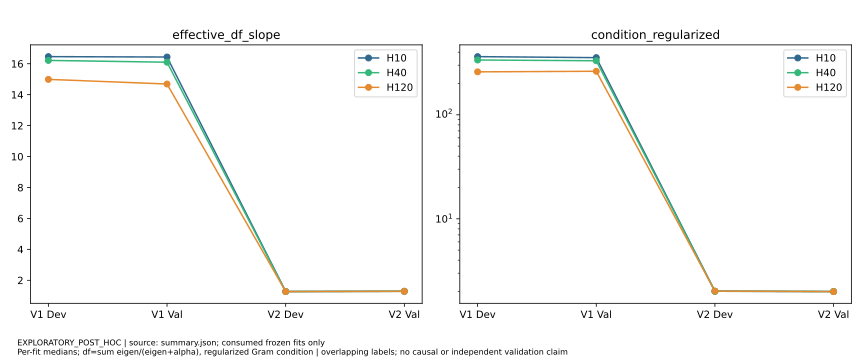
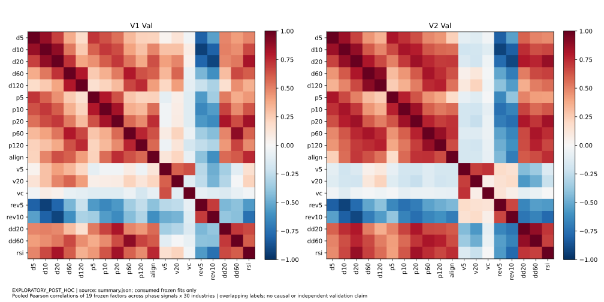
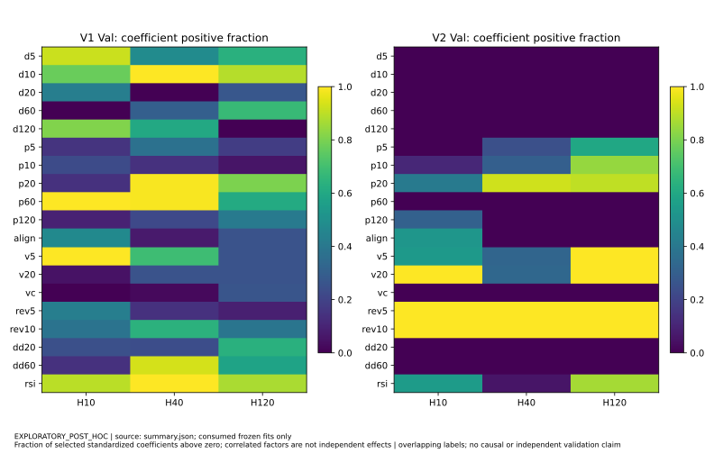
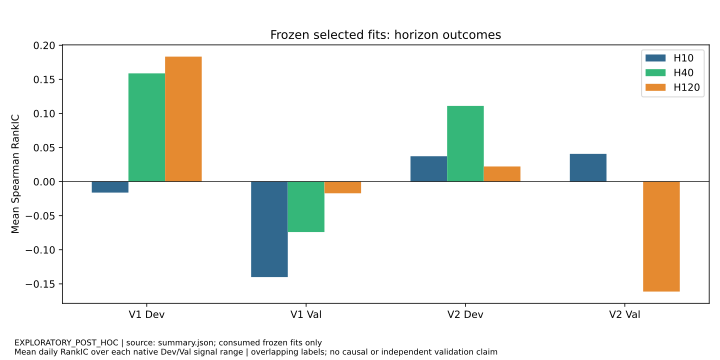
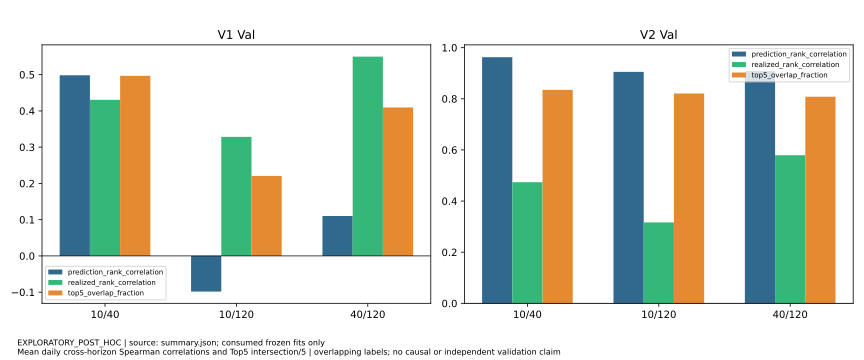
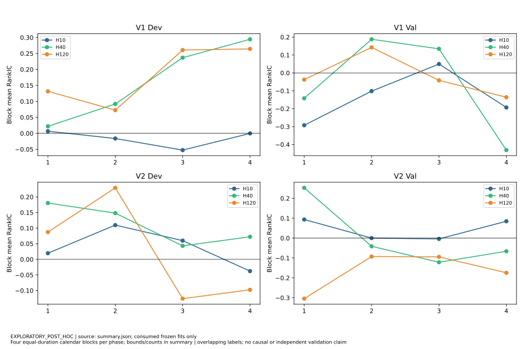
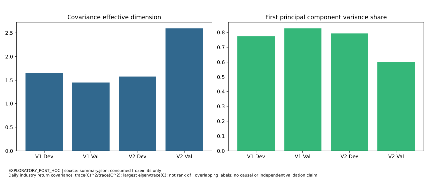

# SWL1 Ridge V1/V2 — POST_HOC_FAILURE_FORENSICS

NOT_A_NEW_VALIDATION · NOT_A_NEW_FINAL_OOS · NOT_A_NEW_MODEL_GENERATION · NOT_PREREGISTERED_PREDICTIVE_EVIDENCE

## Executive assessment

Both generations remain **FAILED_VALIDATION**, forward eligible=false, Final OOS unopened, ETF productization NOT_STARTED. The primary descriptive explanation is an out-of-period horizon-direction mismatch, most pronounced at V2 H120, with highly redundant horizon ranks and limited independent information. **A unique causal root cause is not identifiable.** No confirmed implementation or data-integrity defect was found within the admitted panel/source scope. This does not establish independent historical membership, corporate-action or PIT truth.

Recommend **DATA_FIRST** with moderate confidence for the next action, not predictive success. Establish licensing, contemporaneous membership/availability and source semantics before another model search. A short-horizon reversal/rotation hypothesis is a lower-complexity later option; no family, candidate or protocol is created.

## Immutable evidence and scope

Base main: `2d1a235af8fb770fcde14fdafd36da86a174875a`. V1 selected B-m12-a100, V2 B-m24-l10; both19 factors, STANDARDIZED, horizons10/40/120 and original0.25/0.50/0.25 weights. V1 searched20 preregistered specs; V2 searched16 and admitted3. Only these two selected specifications were replayed, at each one's original Dev/Val dates. All original aggregates, V2 fit-count/alpha-range/trace hashes and source bytes were verified. Exact refits reconstruct frozen functions for diagnostics, without lifecycle calls or new model generations.

Original evidence: [V1 result](swl1-ridge-v1-results.md), [V2 protocol](swl1-ridge-v2-protocol.md), [V2 result](swl1-ridge-v2-results.md). Public aggregates retain the original failure, not a repaired/reopened evaluation. [中文报告](swl1-v1-v2-failure-forensics.zh-CN.md).

## Consumed-data boundary

| Phase | Signal range | Last H10 outcome | Last H40 outcome | Last H120 outcome |
| --- | --- | --- | --- | --- |
| v1 development | 2023-08-02 — 2024-03-25 | 2024-04-10 | 2024-05-27 | 2024-09-19 |
| v1 validation | 2024-09-20 — 2025-04-01 | 2025-04-16 | 2025-06-03 | 2025-09-23 |
| v2 development | 2023-08-02 — 2025-03-31 | 2025-04-15 | 2025-05-30 | 2025-09-22 |
| v2 validation | 2025-09-23 — 2026-04-07 | 2026-04-21 | 2026-06-05 | 2026-09-29 |

Zero-based exchange spine begins2021-08-02. V1 last target index1006; V2 index1251 (2026-09-29), the union cutoff. Numeric returns are admitted through index1251 (1,252 rows); features through last selected signal index1131 (1,132 rows). Dates/codes and shape headers are nonperformance metadata. A boundary manifest is persisted before numerical decoding. Safe compressed-NPY parsing rejects traversal, symlinks, object/structured dtype, hash mismatch and unbounded reads; Fortran columns convert only authorized row prefixes and discard intervening layout bytes opaquely.

V2 Development reused all156 V1 Dev signals and125 of126 V1 Validation signals (2024-09-20–2025-03-31). V2 Validation reused125 of126 originally planned V1 OOS signal dates, plus its endpoint-equality first signal2025-09-23. V1 OOS lifecycle was never opened, but these outcomes consumed by V2 cannot now be claimed unseen for V1 or a next generation. Availability metadata once used to choose an all-history continuous universe is not performance independence: universe selection itself is retrospective.

## Target and implementation audit

Raw label is product of (1+r) over exactly t+1..t+h minus1. The scientific training label subtracts the complete30-industry mean for each training signal. Forecasts use training-only population mean/std; scales<=1e-12 become1. The independent cutoff for each horizon admits i<=t-h, with the exact12/24 calendar-month window and >=30 complete training dates. Target/intercept centering never uses a future label at fit time.

Evaluation correlates average-tie ranks against raw target; subtracting the same universe mean preserves ranks and Top5-minus-Bottom5 spread. Published Top5/Bottom5 are **signed raw** compounded returns, not centered or absolute returns. V1 Bottom5 uses the tail of descending-score/ascending-code order; V2 independently sorts ascending scores/codes. Synthetic ties prove the distinction; actual replay parity is unaffected. V1 native blocks split counts; V2 splits calendar duration. No dropped original signals occurred. Centering residuals are roundoff only; largest factor reconstruction error is7.2475e-13. Full raw stock evidence was not reprocessed.

## Source-quality audit

Primary series is **RECONSTRUCTED_SWL1_EQUAL_WEIGHT**, membership confidence RECONSTRUCTED. Current taxonomy31, frozen model30; excluded510000 has a recursive factual gap. Explicit SWCLASS2021 hierarchy is applied only after its2021-07-31 boundary, not inferred from code prefixes. Membership comes from a later-observed retrospective interval source: no contemporaneous publication proof. Source aggregation gates listing/delisting, exact adjacent exchange sessions, positive volumes/factors, finite adjusted-close ratios and absolute daily stock return<=0.5. Admission needs >=5 valid constituents and >=80% coverage; no recursive series restart after an internal gap.

These checks explain construction, not independent accuracy. Tier A=0, Tier B=0, Tier C6,515,140 listed stock/session rows;1,406 unknown assignment rows excluded. All-history continuously complete universe admission can select using future availability and induce survivorship/completeness bias. Modern interval source may omit historical assignments; backward as-of adjustment availability is not proven contemporaneous corporate-action knowledge. Weighting admits available covered constituents, so it is not an official capitalization-weighted index. Aggregate coverage median1.0 does not resolve these risks. Licensed raw prices/memberships remain private; no official SWL1 source was introduced or selected by performance. Bias direction/magnitude and independent target truth: **NOT_COMPUTABLE_WITH_ADMITTED_EVIDENCE**.

## Ridge conditioning and actual regularization

For standardized training Z, beta=(Z'Z+alpha I)^(-1)Z'(y-mean y). V1 fixedalpha100 yields actual alpha/n roughly0.014..0.027 in Val; V2 alpha=10n yields10. Mean eigen spectra and extremal singular values are published as aggregates. Slope df=sum s²/(s²+alpha); the unpenalized intercept is accounted for separately. This is the trace of the slope smoother, not an independent sample size. See the [NTNU derivation](https://www.math.ntnu.no/emner/MA8701/2023v/MA8701V2023/Part2/L7.html) and [NumPy condition definition](https://numpy.org/doc/2.3/reference/generated/numpy.linalg.cond.html).

V2 median slope df≈1.29 versus V1≈14.69..16.44 in Val; regularized condition≈2 versus V1≈262..354. V2 H120 strongest5 eigen-directions account for mean80.36% of L1 current contribution dispersion, weakest5 only0.88%; corresponding V1 are27.12%/17.54%. Numerical instability is contradicted: V2 solve residual q95<3e-16 and exact prediction/aggregate parity. Heavy shrinkage is observed, **overregularization as the cause of negative H120 is unconfirmed**. Shared-date rank differences show the generations are not equivalent up to score amplitude, but24m versus12m and informed candidate selection remain confounded.

Figure source/range: selected native Dev/Val fits in the boundary table; per-fit medians, slope df and regularized Gram condition. Descriptive; spectra do not establish a profitable or optimally regularized model.

## Factor applicability and coefficient stability

The19 close-derived factors span moving-average displacement, range position, MA alignment, volatility/compression, reversal, drawdown and RSI. Technical backward-only construction was reproduced; signal missingness is zero and all19 factors have positive median cross-section dispersion. Isolated bounded-factor saturation occurs on7/21/32 factor-date occurrences in V1 Dev/V1 Val/V2 Dev; none in V2 Val. Economic appropriateness is unvalidated. V2 Val pooled correlations: d10/rev5=-0.9240, d20/rev10=-0.9094, d60/d120=0.9023. Thus coefficient signs and contribution shares cannot isolate an independent factor effect. No favorable subset was selected.

V2 coefficients are very stable day to day (median adjacent cosine>=0.99986); stable direction can still fail. H120 fitted d5..d120 coefficients are negative throughout Val, while the raw d120 factor-to-H120 target mean IC is+0.24055. This is a measured directional mismatch. V1 Val long-factor mean drift is much larger (d1202.7345 DevSD) than V2 (0.4120). Window length may retain a stale learned direction, but no alpha/window-only experiment identifies that mechanism.

Figures source/range: each generation's consumed Val signals; pooled Pearson factor correlations and per-factor positive-coefficient fractions by horizon. Exploratory, correlated factors and retrospective membership; no per-date fitted model is disclosed.

## Horizon behavior and original fusion

V2 H10 has small positive aggregate IC, H40 is near zero, H120 is negative in all4 equal-calendar blocks (-0.30445,-0.09278,-0.09433,-0.17442). H120 negativity also begins in Dev blocks3/4; it is not exclusive to a single Val block. Available proxies do **not** support a universal story of H10 momentum continuation and H120 mean reversion: V2 Val d10-H10 factor IC=-0.07273, rev10-H10=+0.09531, d120-H120=+0.24055. These are seen-data correlations, not new validated signals.

V2 Val horizon prediction correlations≈0.905..0.963, whereas realized ranks correlate≈0.316..0.579. Predicted Top5 overlaps≈81..83%. Rather than three diversified directional mechanisms, the fitted models mostly rank the same sectors. Sign disagreement still averages18..20% because weak correlated coefficient signs need not drive ranks. V1 Val horizon ranks are much less coherent and sometimes oppose each other.

Original weighted IC contributions in V2 Val: H10 **+0.010162967671**, H40 **+0.000045906386**, H120 **-0.040332291611**, sum **-0.030123417554**. This is only an additive decomposition of the frozen0.25/0.50/0.25 score. It is not a new fused forecast-performance test. No horizon inversion, removal, alternative weight or new candidate was evaluated.

Figures source/range: native consumed Dev/Val selected fits; average daily RankIC and daily cross-horizon rank/Top5 overlap aggregates. Exploratory; different Val dates prohibit a causal winner comparison and overlapping labels limit confidence.

## Regime and window dependence

Finite proxies were fixed before computation: backward20-day equal-industry market trend/volatility, daily CS dispersion/common direction, daily return covariance, successive prediction rank stability and19-factor distribution drift. Four equal-calendar blocks are the only within-phase splits; no regime thresholds or search were used. V1 market trend/volatility changes sharply between Dev/Val; V2 volatility decreases, common movement changes and covariance dimension rises from1.579 to2.595. These are observed state changes, not identified causal regime effects.

V2 H120 train rows10,860..11,010 versus V1 3,480..3,690 in Val; per-horizon mature cutoff removes more recent labels for longer horizons. A24m window and highly persistent coefficients may lag a state change, but source quality, penalty, selection and period effects are inseparable here. Neither a new window nor regime-conditioned model was fit.

Figure source/range: four fixed calendar-duration blocks within the native signal ranges, daily IC arithmetic means; complete counts and dates in appendix. Exploratory; V1 native gate remains equal-count, and these blocks share training and overlapping outcomes.

## Level-1 cross-section and statistical limits

Top5 is one-sixth of30 industries. Mean raw-return covariance participation ratios≈1.45..2.59, first-PC shares≈60..83%, reveal a common market component. They do not mean there are only1..3 independent centered ranks. Average-tie Spearman and per-industry deletion sensitivities were computed without retraining. V2 H120 daily best deletion envelope still averages-0.08838: no fixed single-industry deletion reverses its mean. It does not rule out correlated groups or source bias; no new universe is defined.

126 daily signals are not126 independent observations. At most13/4/2 non-overlapping target windows fit this contiguous Val signal span forH10/H40/H120; training and regimes still overlap. Actual IC lag1 autocorrelations and sensitivity ranges are in JSON/appendix. No IID p-values, bootstrap/HAC claims, statistical significance victories or trading profits are reported.

Figure source/range: daily raw industry returns at native consumed Dev/Val signals; covariance participation ratio and first-PC variance share. Descriptive; covariance effective dimension is neither rank degrees of freedom nor independent time-sample size.

## Controlled comparability and attribution

Both generations use the same30-industry panel/target/horizons, but Val dates and outcomes differ, as do native block definitions. Shared Dev comparison uses156 common dates and one IC method: V1/V2 H10=-0.01615/+0.07519; H40=+0.15877/+0.20286; H120=+0.18331/+0.08843. Prediction-rank correlation averages0.6340/0.7340/0.01981. These show a combined specification difference, not an alpha-only effect or independent superiority. V2 was designed after V1 outcomes and uses V1 Validation information in Dev, so identical phase labels alone cannot restore independence.

Attribution follows six explicit categories A..F; [machine matrix](../../reports/research/swl1_failure_forensics/attribution-matrix.json) and appendix enumerate each dimension. Confirmed defects0/0 within scope. Supported patterns include shrinkage, redundancy, persistent but wrong long-horizon direction, state drift and strong temporal/cross-section dependence. Hypotheses include stale24m learning and overregularization; retrospective bias magnitude and unique causal root cause remain unidentified.

## Next-generation review and genuinely unseen evidence

See [design review](swl1-next-generation-design-review.md) and [five-route comparison](../../reports/research/swl1_failure_forensics/next-generation-options.json). Recommendation DATA_FIRST has moderate action confidence. It does not establish that cleaner data or H10 would succeed. No strategy/protocol/candidate/Validation is created.

Inventory is range-only: ALREADY_SEEN_BY_V1 through2025-09-23; ALREADY_SEEN_BY_V2 through2026-09-29, including training/overlapping horizon information; UNSEEN_BUT_HISTORICALLY_AVAILABLE only2026-09-30 (1 outcome session, not read); PROSPECTIVE_ONLY beyond the admitted date spine; DATA_UNAVAILABLE contemporaneous membership proof and independently admitted official index source. No fully unseen10/40/120 label can currently mature after the union cutoff. There is no currently admitted independent Validation or Final OOS phase for a next generation. Both old OOS lifecycles remain unopened, but much of V1's planned range is now scientifically consumed by V2.

For a future protocol, first admit source rights/PIT independent of performance, record the whole outcome-union boundary, publish result-free economic hypothesis and fixed selection/admission before any new outcomes. Validation targets must start after all seen outcomes and the approved future observation boundary; exchange-session maturity and disjoint phases must be enforced.126 consecutive signals withH120 alone require at least245 unique future outcome sessions; temporal dependence still limits confidence and phase separation adds time. Follow with untouched Final OOS only after that future Validation passes. Do not relabel overlapping historical outcomes as new evidence or shorten requirements to avoid waiting.

## Reproducibility and engineering

Independent pinned developer Docker only; science container network disabled, exact panel/consumed lifecycle evidence read-only, no live/runtime/CNEquity mount. Default CLI audits metadata/hashes without writes or fitting; explicit --replay/--scratch permits the frozen diagnostic replay only. [Synthetic tests](../../tests/test_swl1_failure_forensics.py) include unseen-tail traps in both storage orders, hash/path/codec/layout/serialization failures, condition/df/contributions, missing coefficients, tied ranks/calendar blocks, date-confounded comparison and native parity. Source has no official lifecycle import or call.

Public JSON/SVGs contain only reviewed aggregates. Per-date predictions/coefficient traces remain private task-owned scratch. Ordinary fresh-clone CI needs no licensed facts and never replays market data. A new cumulative [integrity layer](../../reports/engineering/swl1-failure-forensics-integrity.json) binds this source/report transition and all preceding deltas; no previous certificate or frozen artifact changes. [Acceptance record](../engineering/swl1-failure-forensics.md) records canonical quality/security verification and scope. Four existing family/API/status contracts remain unchanged; no scheduler activation, deployment, formal forecasts, ETF events or real orders occurred.

## Auditable numerical appendix / 可审计数值附录

Every value below is a public aggregate from the 2,427 exact selected frozen fits, at the native consumed signal ranges listed above. No individual industry or per-date coefficient/prediction series is published. **EXPLORATORY_POST_HOC** throughout. Source: [summary](../../reports/research/swl1_failure_forensics/summary.json), [manifest](../../reports/research/swl1_failure_forensics/evidence-manifest.json). Correlation and sensitivity are descriptive, not causal. 此处均为已消费范围的汇总，不构成新的验证。

### Native results / 原始结果

| Phase | Signals | H10 IC | H40 IC | H120 IC | Composite | Weighted spread | Native positive blocks |
| --- | --- | --- | --- | --- | --- | --- | --- |
| v1_development | 156 | -0.016146 | 0.158766 | 0.183309 | 0.121174 | 0.026232 | 4/4 |
| v1_validation | 126 | -0.140064 | -0.074015 | -0.017137 | -0.076308 | -0.015404 | 2/4 |
| v2_development | 401 | 0.037213 | 0.111010 | 0.022181 | 0.070354 | 0.009443 | 4/4 |
| v2_validation | 126 | 0.040652 | 0.000092 | -0.161329 | -0.030123 | 0.000668 | 1/4 |

### Training rows and numerical conditioning / 训练与数值条件

| Phase/H | Rows min..max | alpha/n median | Gram cond median | Regularized cond median | Slope df median | Coefficient norm median |
| --- | --- | --- | --- | --- | --- | --- |
| v1_development/10 | 6960..7170 | 0.014245 | 716.32 | 362.486 | 16.461 | 0.009723 |
| v1_development/120 | 3660..3870 | 0.026882 | 759.68 | 258.769 | 14.989 | 0.026270 |
| v1_development/40 | 6060..6270 | 0.016340 | 713.37 | 336.377 | 16.216 | 0.017629 |
| v1_validation/10 | 6780..6990 | 0.014368 | 701.60 | 354.428 | 16.435 | 0.011586 |
| v1_validation/120 | 3480..3690 | 0.027322 | 810.41 | 262.129 | 14.690 | 0.073491 |
| v1_validation/40 | 5880..6090 | 0.016502 | 722.22 | 330.853 | 16.099 | 0.023557 |
| v2_development/10 | 10680..14460 | 10.000000 | 640.23 | 2.011 | 1.275 | 0.000341 |
| v2_development/120 | 7380..11160 | 10.000000 | 689.67 | 2.017 | 1.271 | 0.001669 |
| v2_development/40 | 9780..13560 | 10.000000 | 655.76 | 2.012 | 1.274 | 0.001055 |
| v2_validation/10 | 14160..14310 | 10.000000 | 595.58 | 1.997 | 1.288 | 0.000253 |
| v2_validation/120 | 10860..11010 | 10.000000 | 606.76 | 1.996 | 1.290 | 0.001639 |
| v2_validation/40 | 13260..13410 | 10.000000 | 598.73 | 2.000 | 1.287 | 0.000609 |

The Gram condition is eigen_max/eigen_min; regularized condition=(eigen_max+alpha)/(eigen_min+alpha). Slopes df=sum eigen/(eigen+alpha). Full averaged 19-value spectra, singular-value quantiles, alpha ranges and solve residuals are in JSON. Slope df excludes the formal unpenalized intercept; the centered labels make its fitted value approximately zero. No df is interpreted as independent observations.

### Coefficients and contributions / 系数与贡献

| Phase/H | Median adjacent beta cosine | Median relative beta change | Median Top3 contribution share | Mean weakest5 eigen share | Mean strongest5 eigen share | IC lag1 |
| --- | --- | --- | --- | --- | --- | --- |
| v1_development/10 | 0.998759 | 0.051728 | 0.403203 | 0.237057 | 0.394248 | 0.722272 |
| v1_development/120 | 0.997420 | 0.072669 | 0.424284 | 0.193425 | 0.290279 | 0.750604 |
| v1_development/40 | 0.998460 | 0.057222 | 0.425436 | 0.147301 | 0.435193 | 0.847688 |
| v1_validation/10 | 0.999157 | 0.044577 | 0.483559 | 0.319630 | 0.281997 | 0.591948 |
| v1_validation/120 | 0.998993 | 0.049179 | 0.613675 | 0.175406 | 0.271241 | 0.841347 |
| v1_validation/40 | 0.999103 | 0.044197 | 0.427501 | 0.252252 | 0.173423 | 0.881376 |
| v2_development/10 | 0.999930 | 0.012801 | 0.432237 | 0.014966 | 0.870413 | 0.811221 |
| v2_development/120 | 0.999960 | 0.010740 | 0.484461 | 0.004772 | 0.876506 | 0.911030 |
| v2_development/40 | 0.999968 | 0.008845 | 0.381163 | 0.009244 | 0.904641 | 0.854435 |
| v2_validation/10 | 0.999864 | 0.018261 | 0.381388 | 0.009058 | 0.758823 | 0.749764 |
| v2_validation/120 | 0.999958 | 0.009454 | 0.395696 | 0.008758 | 0.803623 | 0.782260 |
| v2_validation/40 | 0.999919 | 0.013607 | 0.326229 | 0.014119 | 0.804108 | 0.815974 |

Adjacent cosine uses beta_t dot beta_(t-1) divided by their norms. Relative change uses norm(beta_t-beta_(t-1))/norm(beta_(t-1)). Factor contribution share is std_i(z_ij beta_j)/sum_j std_i(z_ij beta_j). Eigen shares use the same L1 dispersion accounting in the ordered training-Gram eigenbasis. These shares do not add to an orthogonal prediction-variance attribution when current exposures are correlated. Eigenbases change across fits. 相关因子贡献不是因果贡献。

### Unified calendar blocks / 统一日历块

| Phase/block | Count | Signals | H10 IC | H40 IC | H120 IC | Composite |
| --- | --- | --- | --- | --- | --- | --- |
| v1_development/1 | 42 | 2023-08-02 — 2023-09-28 | 0.006685 | 0.021876 | 0.131564 | 0.045500 |
| v1_development/2 | 36 | 2023-10-09 — 2023-11-27 | -0.016228 | 0.091806 | 0.072513 | 0.059974 |
| v1_development/3 | 42 | 2023-11-28 — 2024-01-25 | -0.052524 | 0.236813 | 0.260671 | 0.170443 |
| v1_development/4 | 36 | 2024-01-26 — 2024-03-25 | -0.000260 | 0.294376 | 0.264220 | 0.213178 |
| v1_validation/1 | 30 | 2024-09-20 — 2024-11-07 | -0.292354 | -0.141876 | -0.037449 | -0.153389 |
| v1_validation/2 | 34 | 2024-11-08 — 2024-12-25 | -0.101799 | 0.187921 | 0.142524 | 0.104142 |
| v1_validation/3 | 27 | 2024-12-26 — 2025-02-11 | 0.049660 | 0.134594 | -0.041668 | 0.069295 |
| v1_validation/4 | 35 | 2025-02-12 — 2025-04-01 | -0.193059 | -0.431228 | -0.135903 | -0.297855 |
| v2_development/1 | 102 | 2023-08-02 — 2023-12-29 | 0.019573 | 0.180436 | 0.087260 | 0.116926 |
| v2_development/2 | 98 | 2024-01-02 — 2024-05-31 | 0.109650 | 0.148006 | 0.229084 | 0.158687 |
| v2_development/3 | 100 | 2024-06-03 — 2024-10-30 | 0.059938 | 0.043146 | -0.125980 | 0.005062 |
| v2_development/4 | 101 | 2024-10-31 — 2025-03-31 | -0.037756 | 0.072192 | -0.097607 | 0.002256 |
| v2_validation/1 | 29 | 2025-09-23 — 2025-11-10 | 0.093476 | 0.252733 | -0.304453 | 0.073622 |
| v2_validation/2 | 35 | 2025-11-11 — 2025-12-29 | 0.000019 | -0.041182 | -0.092782 | -0.043782 |
| v2_validation/3 | 32 | 2025-12-30 — 2026-02-13 | -0.004004 | -0.121524 | -0.094327 | -0.085345 |
| v2_validation/4 | 30 | 2026-02-24 — 2026-04-07 | 0.084627 | -0.066251 | -0.174416 | -0.055573 |

Four equal calendar-duration blocks over each phase's own registered first/last signal dates. These exploratory V1 blocks differ from its immutable native equal-count gate; V2 blocks match its original gate. Unequal periods remain unequal. They are not four independent experiments.

### Cross-horizon coherence / 周期一致性

| Phase/pair | Prediction rank correlation mean | Realized rank correlation mean | Top5 overlap mean | Beta sign disagreement mean |
| --- | --- | --- | --- | --- |
| v1_development/10_120 | 0.163472 | 0.232583 | 0.235897 | 0.372470 |
| v1_development/10_40 | 0.461199 | 0.380548 | 0.451282 | 0.403509 |
| v1_development/40_120 | 0.181541 | 0.516848 | 0.244872 | 0.348853 |
| v1_validation/10_120 | -0.098353 | 0.328383 | 0.220635 | 0.436090 |
| v1_validation/10_40 | 0.498282 | 0.430563 | 0.496825 | 0.347953 |
| v1_validation/40_120 | 0.110080 | 0.549711 | 0.409524 | 0.282790 |
| v2_development/10_120 | 0.862406 | 0.256099 | 0.695761 | 0.246489 |
| v2_development/10_40 | 0.895071 | 0.423208 | 0.764589 | 0.234808 |
| v2_development/40_120 | 0.930444 | 0.529588 | 0.789526 | 0.122195 |
| v2_validation/10_120 | 0.905348 | 0.316366 | 0.820635 | 0.181287 |
| v2_validation/10_40 | 0.962657 | 0.473814 | 0.834921 | 0.197160 |
| v2_validation/40_120 | 0.908735 | 0.579123 | 0.807937 | 0.193818 |

Prediction and realized correlations are cross-sectional average-tie Spearman per signal, then arithmetic averages. Top5 overlap is intersection size/5 with ascending-code ties. Beta sign disagreement counts sign differences/19. These are not comparisons of new fusion policies.

### Regime proxies / 状态代理

| Phase | Trailing20 market return mean | Trailing20 market vol mean | Daily CS return std mean | Common direction mean | Covariance dimension | First PC share |
| --- | --- | --- | --- | --- | --- | --- |
| v1_development | -0.010760 | 0.012772 | 0.009038 | 0.809402 | 1.654623 | 0.773692 |
| v1_validation | 0.067565 | 0.018594 | 0.010014 | 0.838360 | 1.452497 | 0.826938 |
| v2_development | 0.010022 | 0.015060 | 0.009328 | 0.822776 | 1.578683 | 0.792862 |
| v2_validation | 0.012103 | 0.010179 | 0.009534 | 0.797090 | 2.594744 | 0.602419 |

Market is the equal-weight mean of 30 admitted industry daily returns; trailing20 compounding/volatility only use days up to the signal. Common direction=max(fraction positive,fraction negative). Covariance effective dimension=trace(C)^2/trace(C^2), first PC share=lambda_max/trace(C) on daily raw industry returns in the phase. This raw-return dimension is not centered-target rank degrees of freedom. No exploratory regime split was used for selection.

### Shared Development dates / 共同 Development 日期

| Horizon | V1 shared Dev IC | V2 shared Dev IC | Prediction correlation mean | Changed rank orders |
| --- | --- | --- | --- | --- |
| 10 | -0.016146 | 0.075192 | 0.634035 | 156 |
| 120 | 0.183309 | 0.088426 | 0.019814 | 156 |
| 40 | 0.158766 | 0.202858 | 0.733952 | 156 |

156 shared dates: 2023-08-02–2024-03-25. Same 30 identities, panel, raw targets, horizons and Dev role. Unified IC method; the native Bottom5 tie rule differs (no actual selected prediction ties affected parity). Each selected specification changed ranks on all156 dates. This rejects pure amplitude equivalence; it cannot isolate penalty from12m/24m windows or candidate-selection effects.

### Comparability matrix / 可比性矩阵

| Dimension | Native Validation V1 vs V2 | Shared Development diagnostic |
| --- | --- | --- |
| SAME_UNIVERSE | true,30 | true,30 |
| SAME_FACTUAL_PANEL | true | true |
| SAME_SIGNAL_DATE | false | true,156 dates |
| SAME_HORIZON | true | true,each10/40/120 |
| SAME_TARGET_DEFINITION | true | true |
| SAME_REALIZED_OUTCOME | false | true |
| SAME_EVALUATION_METHOD | RankIC true; native blocks/Bottom5 ties differ | unified RankIC true; native extremes differ |
| SAME_PHASE_ROLE | Validation label true, dates/ownership differ | Dev label true; informed selection remains |

### Frozen factor definitions / 冻结因子定义

| Factor | Definition | Lookback sessions | Scale | Economic hypothesis |
| --- | --- | --- | --- | --- |
| d5 | (close-MA5)/MA5 | 5 | DIMENSIONLESS_WITH_HETEROGENEOUS_SCALE | MA displacement/relative trend |
| d10 | (close-MA10)/MA10 | 10 | DIMENSIONLESS_WITH_HETEROGENEOUS_SCALE | MA displacement/relative trend |
| d20 | (close-MA20)/MA20 | 20 | DIMENSIONLESS_WITH_HETEROGENEOUS_SCALE | MA displacement/relative trend |
| d60 | (close-MA60)/MA60 | 60 | DIMENSIONLESS_WITH_HETEROGENEOUS_SCALE | MA displacement/relative trend |
| d120 | (close-MA120)/MA120 | 120 | DIMENSIONLESS_WITH_HETEROGENEOUS_SCALE | MA displacement/relative trend |
| p5 | clip((close-min5)/(max5-min5+1e-10),0,1) | 5 | DIMENSIONLESS_WITH_HETEROGENEOUS_SCALE | Range position/trend persistence |
| p10 | clip((close-min10)/(max10-min10+1e-10),0,1) | 10 | DIMENSIONLESS_WITH_HETEROGENEOUS_SCALE | Range position/trend persistence |
| p20 | clip((close-min20)/(max20-min20+1e-10),0,1) | 20 | DIMENSIONLESS_WITH_HETEROGENEOUS_SCALE | Range position/trend persistence |
| p60 | clip((close-min60)/(max60-min60+1e-10),0,1) | 60 | DIMENSIONLESS_WITH_HETEROGENEOUS_SCALE | Range position/trend persistence |
| p120 | clip((close-min120)/(max120-min120+1e-10),0,1) | 120 | DIMENSIONLESS_WITH_HETEROGENEOUS_SCALE | Range position/trend persistence |
| align | (3*(MA5>MA10)+2*(MA10>MA20)+(MA20>MA60))/6 | 60 | DIMENSIONLESS_WITH_HETEROGENEOUS_SCALE | Range position/trend persistence |
| v5 | std(pct_change(close),5,ddof=1) | 6 | DIMENSIONLESS_WITH_HETEROGENEOUS_SCALE | Volatility/state change |
| v20 | std(pct_change(close),20,ddof=1) | 21 | DIMENSIONLESS_WITH_HETEROGENEOUS_SCALE | Volatility/state change |
| vc | v5/(v20+1e-10) | 21 | DIMENSIONLESS_WITH_HETEROGENEOUS_SCALE | Volatility/state change |
| rev5 | -mean(pct_change(close),5) | 6 | DIMENSIONLESS_WITH_HETEROGENEOUS_SCALE | Short-term reversal |
| rev10 | -mean(pct_change(close),10) | 11 | DIMENSIONLESS_WITH_HETEROGENEOUS_SCALE | Short-term reversal |
| dd20 | close/rolling_max(close,20)-1 | 20 | DIMENSIONLESS_WITH_HETEROGENEOUS_SCALE | Drawdown/recovery |
| dd60 | close/rolling_max(close,60)-1 | 60 | DIMENSIONLESS_WITH_HETEROGENEOUS_SCALE | Drawdown/recovery |
| rsi | 100-100/(1+mean(gain,14)/(mean(loss,14)+1e-10)) | 15 | 0_TO_100 | Gain/loss oscillator |

All use reconstructed industry close only, backward lookbacks and gap/warmup preservation. RSI is0..100; range/align are bounded; other fractional scales differ. All19 are technically applicable, but economic appropriateness is unvalidated. Signal missingness=0 in every phase and factor; no nearly-constant signal cross section in V2 Val (threshold std<1e-12). Other phases have7/21/32 factor-date occurrences in V1 Dev/V1 Val/V2 Dev, respectively, due to bounded-factor saturation; per-factor counts are in JSON. No factor is constant throughout a phase. Warmup nulls remain outside admitted signals. Complete per-phase dispersion, time distributions,19x19 correlations, per-horizon sign/magnitude/persistence/contribution distributions are in JSON.

### Per-factor audit / 逐因子审计

| Factor | V2 Val CS std median | V1 Dev/Val drift SD | V2 drift SD | V2 Val H10 factor IC | H40 factor IC | H120 factor IC | H120 mean abs beta | H120 beta positive fraction | H120 sign persistence |
| --- | --- | --- | --- | --- | --- | --- | --- | --- | --- |
| d5 | 0.009648 | 0.322737 | 0.001884 | -0.041549 | -0.017194 | 0.061578 | 0.000105 | 0.000000 | 1.000000 |
| d10 | 0.014922 | 0.469218 | -0.000098 | -0.072726 | -0.050133 | 0.077610 | 0.000166 | 0.000000 | 1.000000 |
| d20 | 0.020422 | 0.746954 | 0.010808 | -0.053280 | -0.052916 | 0.091400 | 0.000271 | 0.000000 | 1.000000 |
| d60 | 0.038239 | 1.693849 | 0.160784 | -0.070099 | -0.024472 | 0.122980 | 0.000359 | 0.000000 | 1.000000 |
| d120 | 0.055326 | 2.734502 | 0.412045 | -0.000766 | 0.146392 | 0.240546 | 0.000604 | 0.000000 | 1.000000 |
| p5 | 0.307155 | 0.274236 | 0.132371 | -0.036010 | -0.003132 | 0.064295 | 0.000031 | 0.595238 | 0.960000 |
| p10 | 0.271500 | 0.379841 | 0.151435 | -0.052259 | -0.017913 | 0.087378 | 0.000101 | 0.841270 | 0.992000 |
| p20 | 0.239114 | 0.483715 | 0.163907 | -0.024702 | -0.001713 | 0.128544 | 0.000163 | 0.904762 | 0.984000 |
| p60 | 0.224886 | 0.738721 | 0.378708 | -0.054666 | 0.017290 | 0.167911 | 0.000317 | 0.000000 | 1.000000 |
| p120 | 0.176217 | 1.377203 | 0.719389 | 0.031363 | 0.133291 | 0.204772 | 0.000726 | 0.000000 | 1.000000 |
| align | 0.265767 | 0.682709 | 0.260446 | -0.037712 | -0.006917 | 0.089884 | 0.000206 | 0.000000 | 1.000000 |
| v5 | 0.004659 | 0.475682 | -0.256913 | 0.066254 | 0.096019 | 0.052927 | 0.000379 | 1.000000 | 1.000000 |
| v20 | 0.003417 | 0.628819 | -0.459210 | 0.014570 | 0.086449 | 0.052648 | 0.000618 | 1.000000 | 1.000000 |
| vc | 0.248586 | -0.063629 | 0.093205 | 0.062422 | 0.034910 | 0.027544 | 0.000096 | 0.000000 | 1.000000 |
| rev5 | 0.003993 | -0.392708 | 0.006408 | 0.065907 | 0.050324 | -0.059449 | 0.000129 | 1.000000 | 1.000000 |
| rev10 | 0.002791 | -0.589894 | 0.008753 | 0.095305 | 0.060187 | -0.075121 | 0.000215 | 1.000000 | 1.000000 |
| dd20 | 0.021598 | 0.123197 | 0.281991 | -0.026187 | -0.023756 | 0.101054 | 0.000395 | 0.000000 | 1.000000 |
| dd60 | 0.027528 | 0.300241 | 0.630256 | -0.030360 | -0.051861 | 0.114224 | 0.000744 | 0.000000 | 1.000000 |
| rsi | 10.120186 | 0.590507 | 0.150852 | -0.011282 | 0.012769 | 0.103014 | 0.000088 | 0.865079 | 0.984000 |

Drift=(Val pooled mean-Dev pooled mean)/Dev pooled SD, across phase signals x30 industries, not the frozen fit's scaling. Factor IC uses each raw factor as a descriptive cross-sectional ranking against each already consumed target. It is **NOT_PREREGISTERED_PREDICTIVE_EVIDENCE**, not a factor admission/search result. Coefficients are standardized-X coefficients. Persistence compares consecutive signs; zeros are a separate sign. All hypotheses share the membership, period dependence and correlated-factor limitations.

### Industry deletion sensitivity / 行业删除敏感性

| Phase/H | q95 max abs daily deletion IC change | Mean daily minimum deletion IC | Mean daily maximum deletion IC | Non-overlap window count upper bound |
| --- | --- | --- | --- | --- |
| v1_development/10 | 0.123347 | -0.093126 | 0.063487 | 16 |
| v1_development/120 | 0.116812 | 0.107819 | 0.264952 | 2 |
| v1_development/40 | 0.121548 | 0.079014 | 0.239194 | 4 |
| v1_validation/10 | 0.120586 | -0.222042 | -0.070592 | 13 |
| v1_validation/120 | 0.118008 | -0.100195 | 0.072476 | 2 |
| v1_validation/40 | 0.109598 | -0.152870 | -0.003468 | 4 |
| v2_development/10 | 0.126140 | -0.042740 | 0.113675 | 41 |
| v2_development/120 | 0.123804 | -0.058945 | 0.103266 | 4 |
| v2_development/40 | 0.125981 | 0.034993 | 0.194272 | 11 |
| v2_validation/10 | 0.119804 | -0.040801 | 0.115341 | 13 |
| v2_validation/120 | 0.116383 | -0.251986 | -0.088385 | 2 |
| v2_validation/40 | 0.122553 | -0.086164 | 0.070080 | 4 |

**EXPLORATORY_LEAVE_ONE_OUT_DIAGNOSTIC**: delete each industry in turn, rerank the remaining29, hold the frozen fit/predictions fixed. The daily min/max envelope changes which deleted industry attains it; it is not a new universe. Its mean maximum upper-bounds every fixed-industry deletion's phase mean IC. Thus V2 H120 remains negative even under that favorable per-date upper envelope (-0.088385). Non-overlap counts only bound pairwise outcome intervals; they do not prove independence of training, industry or regime information.

### Failure attribution / 失败归因

| Dimension | Classification | Observed / interpretation |
| --- | --- | --- |
| Target correctness | E_CONTRADICTED_BY_AVAILABLE_EVIDENCE | Exact t+1..t+h compounding, per-date 30-industry training centering; all four native aggregate trees and V2 fit-trace hashes match. No confirmed target alignment, scale, maturity or evaluation defect in admitted scope. Tests do not establish source PIT accuracy. |
| PIT/membership | F_NOT_IDENTIFIABLE | Tier A=0, B=0; 6,515,140 Tier-C listed stock/session rows; historical assignment publication proof absent. Direction and magnitude of retrospective membership bias are not identifiable from the industry panel. |
| Data integrity | F_NOT_IDENTIFIABLE | Pinned panel; 0 post-seed missing admitted returns; factor reconstruction max error 7.25e-13. Full raw stock pipeline was not rerun. No confirmed byte/alignment/feature defect; independent data correctness and corporate-action PIT remain unestablished. |
| Feature suitability | C_SUPPORTED_DESCRIPTIVE_PATTERN | All19 factors have positive median signal dispersion; isolated saturated range/drawdown/align cross sections occur in V1/V2 Dev and V1 Val. Three V2 Validation pairs have abs pooled correlation >0.9. Redundancy is observed; blanket claim that all Level-1 factors are constant is contradicted. Economic sufficiency remains unproved. |
| Ridge conditioning | E_CONTRADICTED_BY_AVAILABLE_EVIDENCE | V2 Validation regularized Gram condition medians 1.9968, 2.0003, 1.9965; solve residual q95 <3e-16. Numerical instability does not explain the replayed H120 failure. Strong shrinkage is not a causal test of underfitting. |
| Regularization strength | C_SUPPORTED_DESCRIPTIVE_PATTERN | V1 alpha/n medians 0.0144/0.0165/0.0273; V2 alpha/n=10; slope df about1.29 versus V1 14.69..16.44. V2 heavily suppresses weak eigen-directions; this changes model shape, but window and selection effects confound attribution. |
| Window dependence | D_PLAUSIBLE_UNCONFIRMED_HYPOTHESIS | Selected V1 12m versus V2 24m; per-horizon mature rows differ; V2 coefficients move slowly. A long window may preserve stale direction; window effect is not separately identified. |
| Coefficient stability | C_SUPPORTED_DESCRIPTIVE_PATTERN | V2 Validation successive coefficient cosine medians >=0.99986; H120 d5..d120 mean coefficients negative on every date. Stable fitted direction can be predictively wrong; sign persistence is not economic robustness. |
| H10 behavior | C_SUPPORTED_DESCRIPTIVE_PATTERN | V1 Val IC=-0.1401, V2 Val=0.04065. V2 d10 factor-H10 mean IC=-0.07273; rev10=0.09531. H10-only interest is a seen-data hypothesis; simple short-horizon momentum continuation is not supported in V2 Val. |
| H40 behavior | C_SUPPORTED_DESCRIPTIVE_PATTERN | V2 Val IC=0.0000918; calendar blocks 0.2527,-0.04118,-0.12152,-0.06625. Average is near zero and varies by period; not a proved stable transition mechanism. |
| H120 behavior | C_SUPPORTED_DESCRIPTIVE_PATTERN | V2 Val IC=-0.16133, all4 calendar block means negative. Daily best one-industry deletion upper envelope averages -0.08838. Failure spans all predefined blocks and cannot be removed by any single fixed industry deletion. Not proof across regimes. |
| Long-horizon mean reversion claim | E_CONTRADICTED_BY_AVAILABLE_EVIDENCE | V2 Val d120-H120 mean factor RankIC=+0.24055; fitted standardized d120 coefficient negative throughout. Available long-horizon relation is continuation for this price proxy, opposite the fitted direction; universal H120 mean reversion is unsupported. |
| Fusion coherence | C_SUPPORTED_DESCRIPTIVE_PATTERN | V2 Val prediction pair correlations 0.9627,0.9053,0.9087 versus realized0.4738,0.3164,0.5791. Top5 overlaps81..83%. Horizons mostly share ranks, not diversify. H120 contributes -0.04033 to original weighted IC. No alternative fusion evaluated. |
| Regime dependence | C_SUPPORTED_DESCRIPTIVE_PATTERN | V1 d120 Dev/Val mean drift2.7345 Dev SD; V2 0.4120. Covariance effective dimension changes1.579 to2.595 in V2. Market/factor state changes are observed; causal regime attribution is not identified. |
| Cross-section limitations | C_SUPPORTED_DESCRIPTIVE_PATTERN | 30 industries, Top5=1/6; raw daily covariance participation ratios1.45..2.59; Validation IC lag1 correlations0.59..0.88. Strong common moves and overlapping labels restrict confidence. Covariance dimension is not the sample size of centered rank IC. |
| V1/V2 comparability | F_NOT_IDENTIFIABLE | Validation dates/outcomes differ; V1 equal-count blocks versus V2 equal-calendar.156 shared Dev dates available. Native Validation aggregates cannot identify a model winner; shared Dev changes combine penalty, window and selection. |
| Primary failure mechanism | C_SUPPORTED_DESCRIPTIVE_PATTERN | Out-of-period directional mismatch concentrated at V2 H120, highly coherent horizon ranks, strong shrinkage and limited independent observations. Descriptive failure pattern is supported; a unique causal source/model/window/penalty root cause is NOT_IDENTIFIABLE. |
| Overregularization causes H120 | D_PLAUSIBLE_UNCONFIRMED_HYPOTHESIS | Strong shrinkage is measured, but no fixed-date same-window alpha-only causal experiment was authorized. Plausible underfitting mechanism; cannot state causation or optimum penalty. |

### Immutable lineage / 不可变谱系

| Artifact | SHA256 |
| --- | --- |
| config/research/swl1-ridge-v1-candidate.json | `c5917b83d5c81627cfa88ae19d1691fd7356b7c91134be1472c1047e2a31ab6c` |
| config/research/swl1-ridge-v1-protocol.json | `3d148ba7adc4846cd3fa951a46dc224f34a5070a8dd5cfa50523bca4a0c5222e` |
| config/research/swl1-ridge-v2-candidate.json | `c94d511d925e47947b12d12a1b8c0380417da525282651a790ca55f84c81efad` |
| config/research/swl1-ridge-v2-protocol.json | `df832a94eba54d703110defe2e7f0169e9de93a316a7def795a38fe9e50e428a` |
| reports/research/swl1_ridge_v1/data_feasibility.json | `39aff56e15b730bc834cb7407a086546a75f7d4f292ee0cadc38294e1987fad3` |
| reports/research/swl1_ridge_v1/development.json | `a031bec412de2c86008eeb2b9272f8409fd17ce79b8ef511a893d497003dfeda` |
| reports/research/swl1_ridge_v1/factor_audit.json | `c3998b221e4b210271dee6e6e4b6ae118cc4a34717900820425c2d1ef8f9f041` |
| reports/research/swl1_ridge_v1/status.json | `9d2a6b9d418e88008a0125d4004fd9283735ce5fd1b854f7a9de607f73eb6569` |
| reports/research/swl1_ridge_v1/validation.json | `4f39211fb8fcdd3e350355414b753065940b8bdb42bb2ee57a432b89241c205c` |
| reports/research/swl1_ridge_v2/development.json | `8715911746935fcf27200a76d17f402cd95f61f3eaa36312f947c07081be13f2` |
| reports/research/swl1_ridge_v2/status.json | `5453501bbe21068042f9691f3cf900513e6d529a28dd8de3f73b624cc7b6eb85` |
| reports/research/swl1_ridge_v2/validation.json | `e1fea05ccef53c1767f3e8e6b845c9e52e23112543856bbe85095501706dbc97` |

The manifest also pins every preregistered implementation file, the original private panel hash, private consumed claim/result byte hashes and independent forensic source hashes. Private claims/results were hashed as opaque integrity evidence, not republished. Their historical lifecycle was never called. Data-file byte hashing and Fortran layout-tail skipping are distinguished from numeric outcome decoding:29 intervening future-column tails (232 bytes) were discarded without floating-point conversion, and the last column tail was not decoded. The1 unseen outcome row never entered an ndarray, target, IC or spread;121 future feature rows were likewise excluded.
